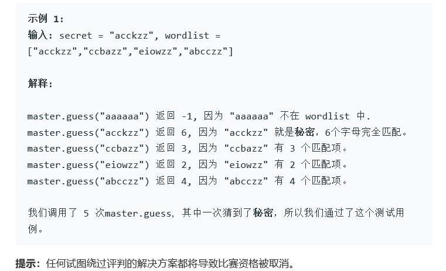

# 题目




# 算法

```python

```

```c++
	这个有问题，他的Master没有实现，编译通不过，天知道怎么办。
    但是这里的猜测算法还是很有意思的。
    这个不是我的算法
    核心问题，wordlist里面有可行解！
/**
 * // This is the Master's API interface.
 * // You should not implement it, or speculate about its implementation
 * class Master {
 *   public:
 *     int guess(string word);
 * };
 */
class Solution {
public:
    int calSim(const string& s1, const string& s2) {
        int res = 0;
        for (int i = 0; i < 6; ++i) {
            res += s1[i] == s2[i];
        }
        return res;
    }
    int findNext(const vector<vector<int> >& sim, const vector<bool>& candidates) {
        int N = candidates.size();
        int mn = INT_MAX;
        int mn_ind = -1;
        for (int i = 0; i < N; ++i) {
            if (!candidates[i]) continue;
            vector<int> counts(6, 0);
            for (int j = 0; j < N; ++j) {
                if (j == i || !candidates[j]) continue;
                ++counts[sim[i][j]];
            }
            int mx = *max_element(counts.begin(), counts.end());
            if (mx < mn) {
                mn = mx;
                mn_ind = i;
            }
        }
        return mn_ind;
    }
    void findSecretWord(vector<string>& wordlist, Master* master) {
        int N = wordlist.size();
        vector<vector<int> > sim(N, vector<int>(N, 0));
        //sim表示i和j之间的相似度
        for (int i = 0; i < N; ++i) {
            sim[i][i] = 6;
            for (int j = i + 1; j < N; ++j) {
                sim[i][j] = sim[j][i] = calSim(wordlist[i], wordlist[j]);
            }
        }
        vector<bool> candidates(N, true);
        while (true) {
            int i = findNext(sim, candidates);
            int s = master.guess(wordlist[i]);
            if (s == 6) return;
            for (int j = 0; j < N; ++j) {
                if (candidates[j] && sim[j][i] != s) {
                    candidates[j] = false;
                }
            }
        }
    }
};
```

