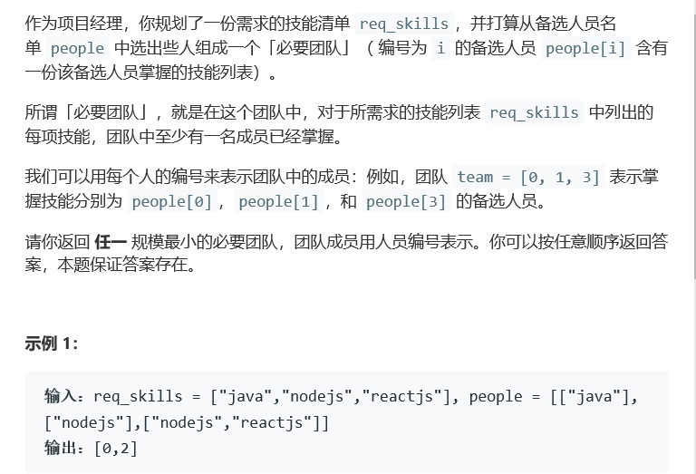
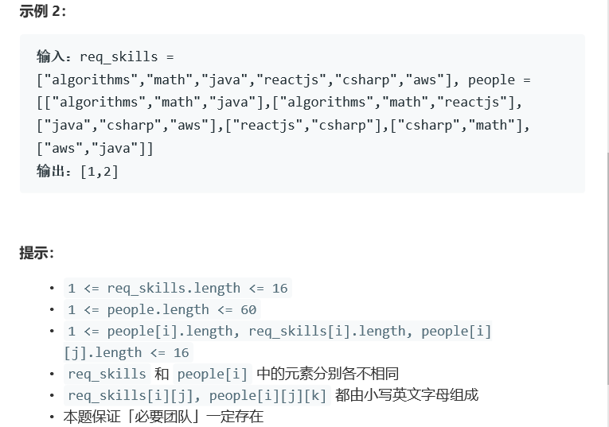

# 题目




# 算法

```python

```

```c++
class Solution {
public:
    vector<int> smallestSufficientTeam(vector<string>& req_skills, vector<vector<string>>& people) {
        const int maxn=10000;
        unordered_map<string,int>skills;
        int m=0;
        for(auto s:req_skills)
            skills[s]=m++;
        int n=people.size();
        vector<int>p(n,0);
        for(int i=0;i<n;i++)
            for(auto s:people[i])
                p[i]=p[i]|(1<<skills[s]);
        vector<int>f(1<<m,maxn);
        vector<pair<int,int> >g(1<<m);
        f[0]=0;
        g[0]=make_pair(-1,-1);
        for(int i=0;i<n;i++)
            for(int j=(1<<m)-1;j>=0;j--)
                if(f[j|p[i]]>f[j]+1)
                {
                    f[j|p[i]]=f[j]+1;
                    g[j|p[i]]=make_pair(i,j);
                }
        vector<int>ans;
        for(int j=(1<<m)-1;j;j=g[j].second)
            ans.push_back(g[j].first);
        return ans;
        
    }
};
```

[https://blog.csdn.net/zark721/article/details/96100639]: 

