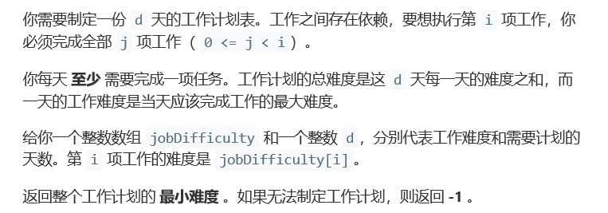
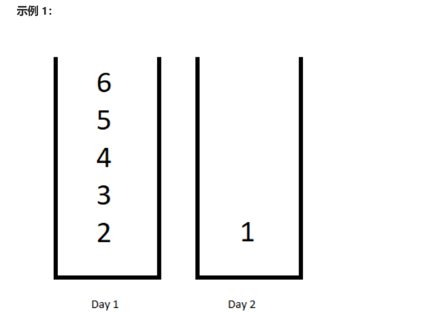
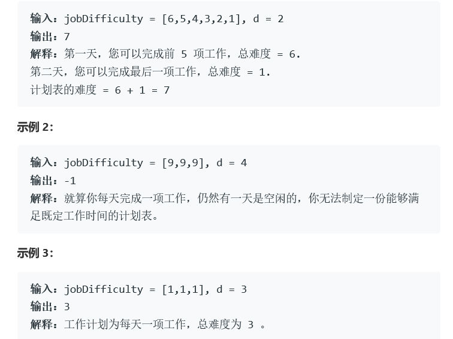
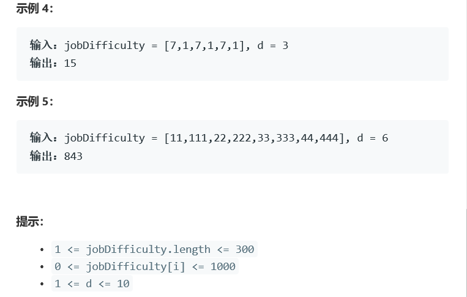

# 题目







# 算法

```python

```

```c++
class Solution {
public:
	int minDifficulty(vector<int>& jobDifficulty, int d) {
		int maxi[310][310];
		int dp[15][310];
		int n = jobDifficulty.size();
		if (d > n) return -1;
		memset(maxi, 0, sizeof(maxi));
		memset(dp, 0x3f, sizeof(dp));

		for (int i = 0; i < n; i++) {
			maxi[i][i] = jobDifficulty[i];
			for (int j = i + 1; j < n; j++)
				maxi[i][j] = max(maxi[i][j - 1], jobDifficulty[j]);
		}
		dp[0][0] = 0;
		for (int day = 1; day <= d; day++) {
			for (int j = day; j <= n; j++) {
				for (int k = day-1; k < j; k++) {
					dp[day][j] = min(dp[day][j], dp[day - 1][k] + maxi[k][j - 1]);
				}
			}
		}
		return dp[d][n];
	}
};

作者：wu-bin-cong
链接：https://leetcode-cn.com/problems/minimum-difficulty-of-a-job-schedule/solution/yu-chu-li-dp-by-wu-bin-cong/
来源：力扣（LeetCode）
著作权归作者所有。商业转载请联系作者获得授权，非商业转载请注明出处。
```

