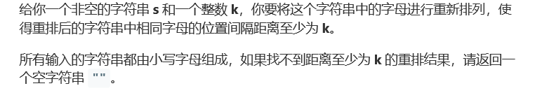
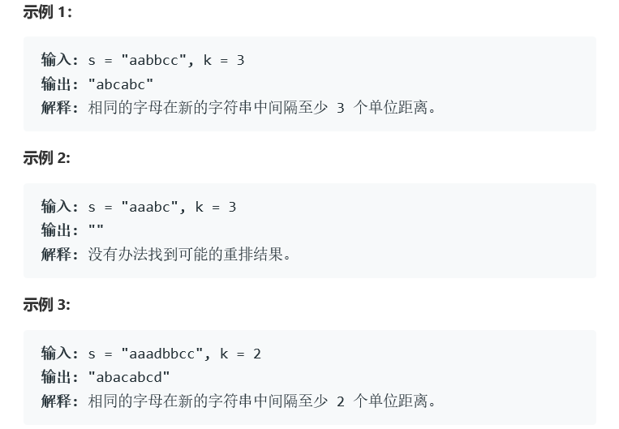

# 题目




# 算法

```python

```

```c++
class Solution {
public:
    string rearrangeString(string s, int k) {

		string ans = "";
		map<char, int> m;
		for (char ch : s) m[ch]++;
		priority_queue<pair<int, char> > q;	//使用优先队列，先填充频数高的字母
		for (pair<char, int> o : m) q.push(make_pair(o.second, o.first));

		int maxcharcnt = 0;
		int maxcnt = q.top().first;
		for (pair<char, int> o : m) { if (o.second == maxcnt) maxcharcnt++; };
		int require_len = (maxcnt - 1) * k + maxcharcnt;	//只要s长度大于该值，肯定都会有满足要求的结果
		if (s.size() < require_len) return ans;

		int base = 0;
		int pos = base;
		ans.resize(s.size());
		while (q.size()) {
			pair<int, char> o = q.top();
			q.pop();
			while (o.first-- > 0) {
				ans[pos] = o.second;
				pos += k;
				if (pos >= s.size()) {
					base = (base + k - 1) % k;	//base取值顺序为 0, k-1, k-2, ...... 2, 1
					pos = base;
				}
			}
		}

		return ans;
    }
};
/*
c++双百代码（看下面），两个关键点：
    1、判断是否有满足条件的结果 : 字符串长度 >= (maxcnt - 1) * k + maxcntchar ,maxcnt为单字符出现最多的次数,maxcntchar为出现次数为maxcnt的字符串的数量，比如 aaaabbbbcc中 maxcnt = 2, maxcntchar=2
    2、如果填充返回的结果: 比如返回的结果长度为14且k=4，把0~13按余数不同分为4组 {0,4,8,12} {1,5,9,13} {2,6,10} {3,7,11}。按字母出现频率从高到低依次填充字母，先取余数为0的集合 {0,4,8,12}，再取余数为3(k-1)的集合{3,7,11},接着取余数为2(k-2)的集合 {2,6,10}，最后才是余数为1的集合 {3,7,11}。这样填充可以保证返回的结果满足要求，取集合顺序不按这个来的话可能会有问题，比如倒数第二个case （s="abcdabcdabdeac" k=4）
*/
```

