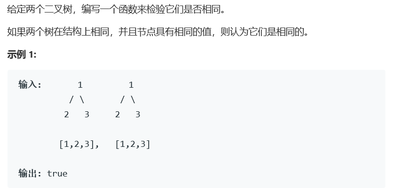

# 题目




# 算法

递归方法

```python
# Definition for a binary tree node.
# class TreeNode:
#     def __init__(self, x):
#         self.val = x
#         self.left = None
#         self.right = None

class Solution:
    def isSameTree(self, p: TreeNode, q: TreeNode) -> bool:
        # p and q are both None
        if not p and not q:
            return True
        # one of p and q is None
        if not q or not p:
            return False
        if p.val != q.val:
            return False
        return self.isSameTree(p.right, q.right) and \
               self.isSameTree(p.left, q.left)
        
        """
        python的空为none，使用not来判定不用！=
        """
```

```c++
/**
 * Definition for a binary tree node.
 * struct TreeNode {
 *     int val;
 *     TreeNode *left;
 *     TreeNode *right;
 *     TreeNode(int x) : val(x), left(NULL), right(NULL) {}
 * };
 */
class Solution {
public:
    bool isSameTree(TreeNode* p, TreeNode* q) {
        if(p != nullptr && q != nullptr){
            if(p->val != q->val)
                return false;
            else{
                return isSameTree(p->left, q->left) & isSameTree(p->right, q->right);
            }
        }else{
            if(p == nullptr && q == nullptr)
                return true;
            else return false;
        }
    }
};
```

迭代方法

```python
from collections import deque
# deque 对应c++中的que，同时不需要make_pair函数
class Solution:
    def isSameTree(self, p, q):
        """
        :type p: TreeNode
        :type q: TreeNode
        :rtype: bool
        """    
        def check(p, q):
            # if both are None
            if not p and not q:
                return True
            # one of p and q is None
            if not q or not p:
                return False
            if p.val != q.val:
                return False
            return True
        
        deq = deque([(p, q),])
        while deq:
            p, q = deq.popleft()
            if not check(p, q):
                return False
            
            if p:
                deq.append((p.left, q.left))
                # 真是简单的make_pair
                deq.append((p.right, q.right))
                    
        return True
```

