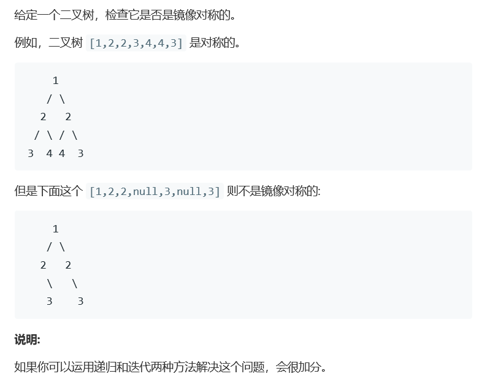

# 题目



# 算法

```python
# Definition for a binary tree node.
# class TreeNode:
#     def __init__(self, x):
#         self.val = x
#         self.left = None
#         self.right = None

class Solution(object):
	def isSymmetric(self, root):
		"""
		:type root: TreeNode
		:rtype: bool
		"""
		if not root:
			return True
		def dfs(left,right):
			# 递归的终止条件是两个节点都为空
			# 或者两个节点中有一个为空
			# 或者两个节点的值不相等
			if not (left or right):
				return True
			if not (left and right):
				return False
			if left.val!=right.val:
				return False
			return dfs(left.left,right.right) and dfs(left.right,right.left)
		# 用递归函数，比较左节点，右节点
		return dfs(root.left,root.right)

```

```c++
/**
 * Definition for a binary tree node.
 * struct TreeNode {
 *     int val;
 *     TreeNode *left;
 *     TreeNode *right;
 *     TreeNode(int x) : val(x), left(NULL), right(NULL) {}
 * };
 */
class Solution {
public:
    bool Same(TreeNode* left,TreeNode *right){
        if(left == nullptr && right == nullptr)
            return true;
        if(left == nullptr || right == nullptr)
            return false;
        if(left->val == right->val)
            return Same(left->left,right->right)&&Same(left->right, right->left);
        return false;
    }
    bool isSymmetric(TreeNode* root) {
        if(!root) return true;
        TreeNode* left = root->left, *right = root->right;
        if(left == nullptr && right == nullptr)
            return true;
        if(left == nullptr || right == nullptr)
            return false;
        if(left->val == right->val)
            return Same(left,right);
        return false;
    }
};
```

```c++
/**
 * Definition for a binary tree node.
 * struct TreeNode {
 *     int val;
 *     TreeNode *left;
 *     TreeNode *right;
 *     TreeNode(int x) : val(x), left(NULL), right(NULL) {}
 * };
 */
class Solution {
public:
    bool Same(TreeNode* left,TreeNode *right){
        if(left == nullptr && right == nullptr)
            return true;
        if(left == nullptr || right == nullptr)
            return false;
        if(left->val == right->val)
            return Same(left->left,right->right)&&Same(left->right, right->left);
        return false;
    }
    bool isSymmetric(TreeNode* root) {
        if(!root) return true;
        TreeNode* left = root->left, *right = root->right;
        return Same(left,right);
    }//减少一次提前判定，实际上增加了一次函数调用，对于最终结果的判定其实是不利的。
};
```

递归判定。