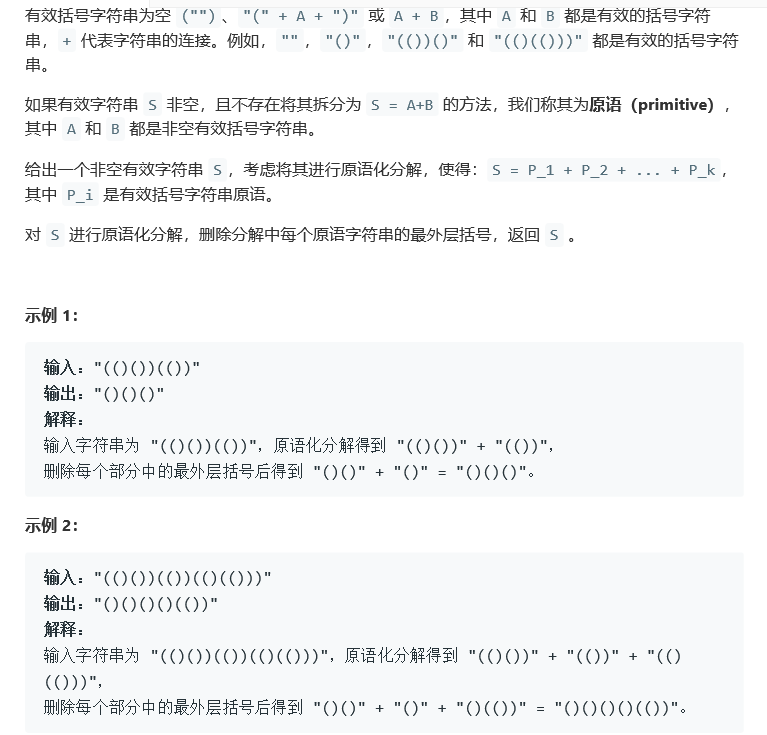
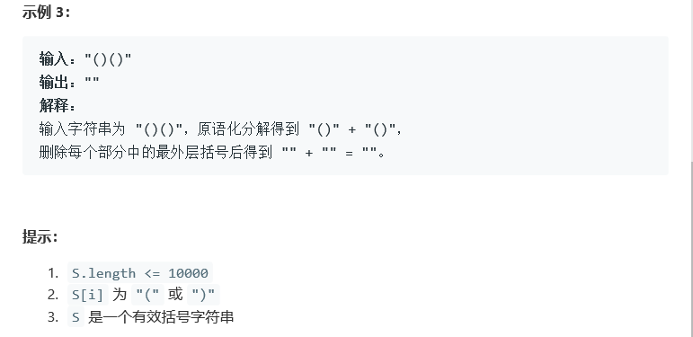

# 题目





# 算法

```python

```

```c++
class Solution {
public:
    string removeOuterParentheses(string S) {
        string res = "";
        int begin = 0, end = 0, left = 0, right = 0, size = S.size();
        while(end < size){
            if(S[end] == '(')
                left += 1;
            if(S[end] == ')')
                right += 1;
            if(left == right){
                res += S.substr(begin+1,end-begin-1);
                left = 0;
                right = 0;
                begin = end+1;
            }
            end++;
        }
        return res;
    }
};
```

