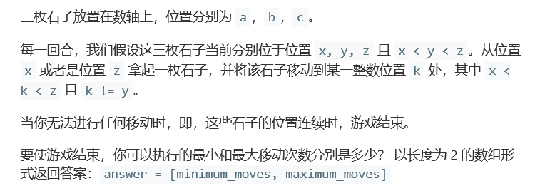
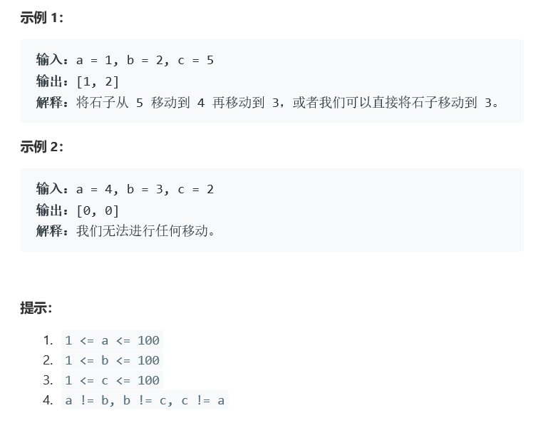

# 题目




# 算法

```python

```

```c++
class Solution {
public:
    vector<int> numMovesStones(int a, int b, int c) {
        vector<int> input = {a,b,c};
        vector<int> res(2);
        sort(input.begin(),input.end());
        cout<<input[0]<<" "<<input[1]<<" "<<input[2]<<endl;
        res[1] = input[2] - input[0] - 2;
        res[0] = 2;
        if(input[2] == input[1]+1 || input[1] == input[0]+1){
            res[0] = !(input[1] - input[0] == 1) + !(input[2] - input[1] == 1);
        }
        if(input[2] == input[1] + 2 || input[1] == input[0] + 2){
            res[0] = 1;
        }

        return res;
    }
};
//如果不适用vector进行排序的话，境况还会好一些，毕竟空间相对就大了。
//最大情况为两边一个一个的向中间靠
//最小请情况则要分两种，1）有可插空或者相邻的情况，是1，2）其余情况是2.
//在上方的最小情况的计算当中，使用两个非语句，可以解决完全相邻的问题，同时也被容纳在了最大情况之中
```

