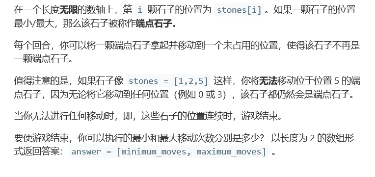
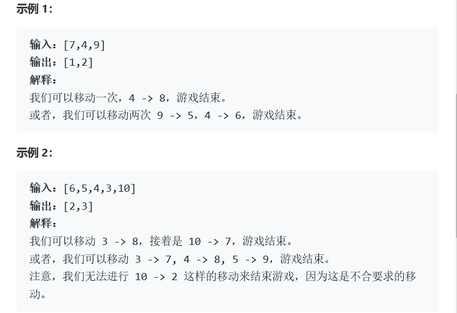
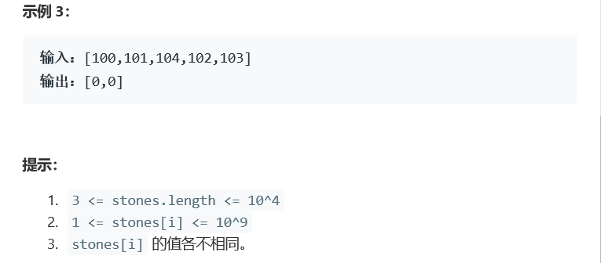

# 题目






# 算法

```python

```

```c++
class Solution {
public:
    vector<int> numMovesStonesII(vector<int>& stones) {
        sort(stones.begin(),stones.end());
        
        int n=stones.size(),minMove=n;
        
        for(int i=0,j=0;j<n;++j)
        {
            //当前窗口的大小大于n
            while(stones[j]-stones[i]+1>n)i++;
            
            //当前窗口的石子个数
            int already_stone=(j-i+1);
            
            //前n-1个石子的顺序连续，最后一个石子不连续，需要移动2步。
            //比如3 4 5 6 10，我们不能直接将10变为2，而是将3变为8，然后10变为7来移动
            if (already_stone==n-1&&stones[j]-stones[i]+1==n-1)
                minMove=min(minMove,2);
            else
                minMove=min(minMove,n-already_stone);
            
        }
        return {minMove,max(stones[n-1]-stones[1]-n+2, stones[n-2]-stones[0]-n+2)};
    }
};

作者：xiaoneng
链接：https://leetcode-cn.com/problems/moving-stones-until-consecutive-ii/solution/chua-dong-chuang-kou-by-xiaoneng-2/
来源：力扣（LeetCode）
著作权归作者所有。商业转载请联系作者获得授权，非商业转载请注明出处。
```

