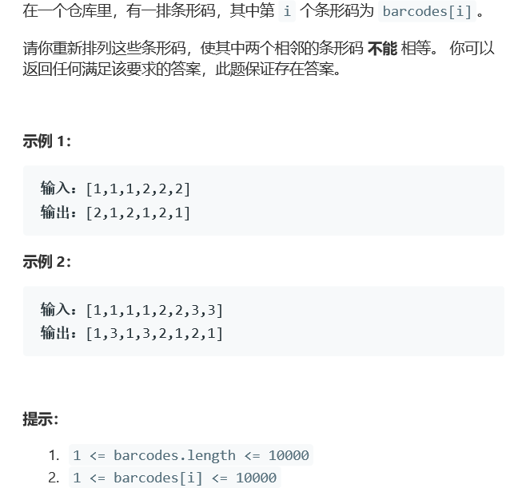

# 题目



# 算法

```python

```

```c++
class Solution {
public:
    struct cmp{
        bool operator()(pair<int,int>&a,pair<int,int>&b){
            return a.second<b.second;
        }
    };
    vector<int> rearrangeBarcodes(vector<int>& barcodes) {
        unordered_map<int,int>mp; 
        for(auto i : barcodes){
            mp[i]++;
        }
        priority_queue<pair<int,int>,vector<pair<int,int>>,cmp>q;//自定义大顶堆
        for(auto i : mp){
            pair<int,int>t;
            t.first=i.first;
            t.second=i.second;
            q.push(t);
        }
        int i=0;
        while(!q.empty()){
            int a=q.top().first;
            int b=q.top().second;
            while(b--){
                //奇数位存放频次最高的元素，直到到达尾部，开始在偶数位存放
                if(i>=barcodes.size())i=1;
                barcodes[i]=a; 
                i+=2;
            }
            q.pop();
        }
        return barcodes;
    }
};
```

