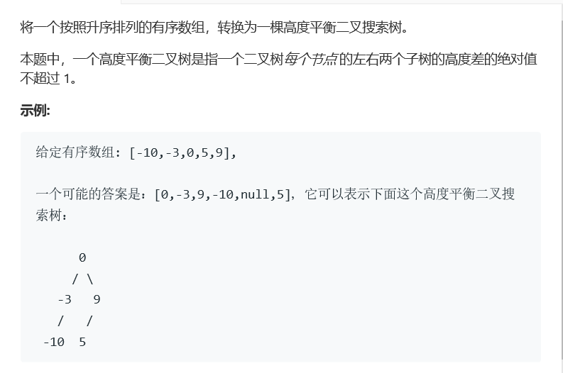

# 题目




# 算法

```python

```

```c++
/**
 * Definition for a binary tree node.
 * struct TreeNode {
 *     int val;
 *     TreeNode *left;
 *     TreeNode *right;
 *     TreeNode(int x) : val(x), left(NULL), right(NULL) {}
 * };
 */
class Solution {
public:
    TreeNode* sorted(vector<int>& nums, int start, int end) {
        if(start > end)
            return nullptr;
        if(start == end){
            TreeNode* res = new TreeNode(nums[start]);
            return res;
        }
        int mid = (start+end)/2;
        TreeNode* res = new TreeNode(nums[mid]);
        res->left = sorted(nums,start,mid-1);
        res->right = sorted(nums,mid+1,end);
        return res;
    }
    TreeNode* sortedArrayToBST(vector<int>& nums) {
        //就是不断找中间值然后分布呗
        sort(nums.begin(),nums.end());
        return sorted(nums,0,nums.size()-1);
    }
};
```

