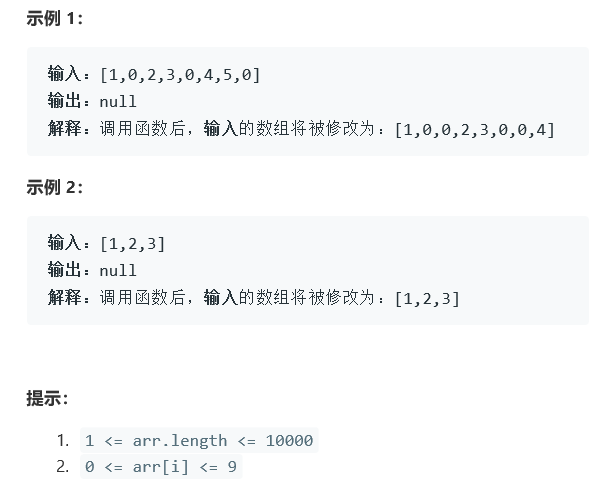

# 题目




# 算法

```python

```

```c++
class Solution {
public:
    void duplicateZeros(vector<int>& arr) {
        if(arr.size()<=1)
            return;
        for(int i=0; i<arr.size()-1; i++)
        {
            if(arr[i] == 0)
            {
                int j;
                for( j=arr.size()-1; j>=i+2; j--)
                {
                    arr[j] = arr[j-1];
                }
                arr[i+1] = 0;
                i++;
            }
        }
    }
};
```

