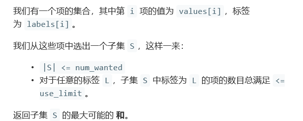
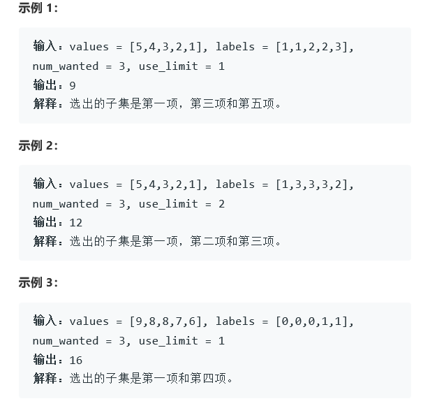
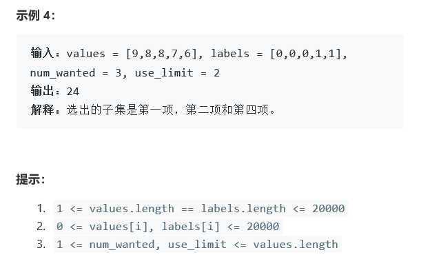

# 题目







# 算法

```python

```

```c++
class Solution {
public:
    static bool cmp(pair<int, int>a, pair<int, int>b)
    {
        return a.first > b.first;
    }
    
    int largestValsFromLabels(vector<int>& values, vector<int>& labels, int num_wanted, int use_limit) {
        if(values.size() == 0 || labels.size() == 0|| num_wanted == 0 || use_limit == 0)
            return 0;
        vector<pair<int, int>>res;
        for(int i=0; i<values.size(); i++)
        {
            res.push_back(make_pair(values[i], labels[i]));
        }
        sort(res.begin(), res.end(), cmp);
        unordered_map<int, int>mp;
        vector<int>ans;
        for(int i=0; i<res.size(); i++)
        {
            if(ans.size() == num_wanted )
                break;
            else
            {
                if(mp.find(res[i].second) == mp.end())
                    mp[res[i].second] = 0;
                if(mp[res[i].second] < use_limit)
                {
                    ans.push_back(res[i].first);
                    mp[res[i].second] ++;
                }
                else
                    continue;
            }
        }
        return accumulate(ans.begin(), ans.end(), 0);
        //感觉对于use——limit的考虑没有到位。
        //例如 有一个label单数但是很大，另一个label复数但是相对小，但是后者和更大，然后使用上面的那个方法，处理不了这个问题。
        //不好意思，看错题目了
    }
};

```

