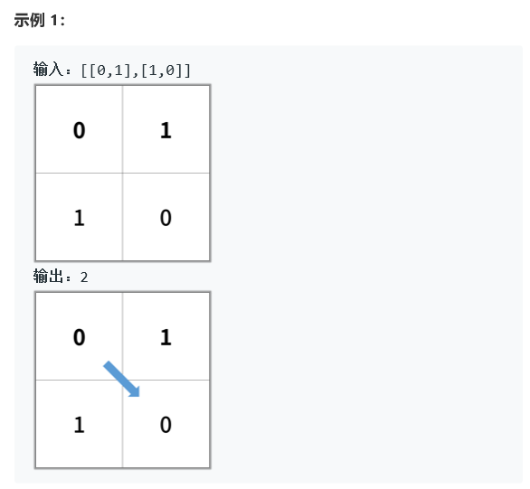

# 题目





# 算法

```python

```

```c++
class Solution {
public:
    int shortestPathBinaryMatrix(vector<vector<int>>& grid) {
        //最短路径bfs
        int m=grid.size()-1,n=grid[0].size()-1;
        int xx[8]={0,1,1,1,0,-1,-1,-1},yy[8]={1,1,0,-1,-1,-1,-1,1};
        int ans=1;
        bool flag=false;
        queue<pair<int,int> > q;
        if(grid[0][0]==1)return -1;
        grid[0][0]=1;
        q.push(make_pair<int,int>(0,0));
        q.push(make_pair<int,int>(-1,0));
        while(!q.empty()){
            pair<int,int> t=q.front();
            q.pop();
            int x=t.first,y=t.second;
            printf("%d %d\n",x,y);
            if(x==-1){
                ans++;
                if(!q.empty())q.push(make_pair(-1,-1));
                continue;
            }
            if(t.first==m&&t.second==n){flag=true;break;}
            
            for(int i=0;i<8;i++){
                int nextx=x+xx[i],nexty=y+yy[i];
                if(nextx>=0&&nextx<=m&&nexty>=0&&nexty<=n){
                    if(grid[nextx][nexty]==0){
                        q.push(make_pair(nextx,nexty));
                        grid[nextx][nexty]=1;                            
                    }
                }
            }
        }
        return flag?ans:-1;
    }
};
```

