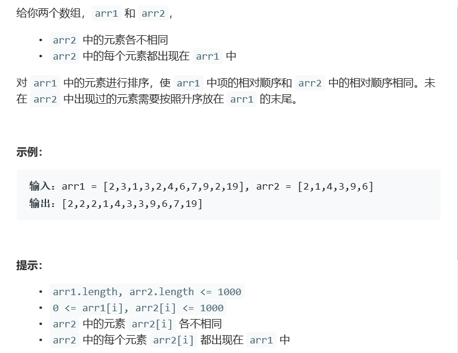

# 题目




# 算法

```python

```

```c++
class Solution {
public:
    vector<int> relativeSortArray(vector<int>& arr1, vector<int>& arr2) {
        map<int,int> dic;
        int size1 = arr1.size(),size2 = arr2.size(),loc = 0, loc1 = 0;
        if(size1 < 2)
            return arr1;
        for(auto a : arr1){
            dic[a]++;
        }
        for(int i = 0; i < size2 ; i++){
            int n = arr2[i], num = dic[arr2[i]];
            for(int j = 0; j < num; j++){
                arr1[loc+j] = n;
            }
            loc += num;
            dic.erase(n);
        }
        for(auto a: dic){
            int n = a.first, num = a.second;
            for(int j = 0; j < num; j++){
                arr1[loc+loc1+j] = n;
            }
            loc1+= num;
        }
        sort(arr1.begin() + loc, arr1.end());//后半部分排序！
        return arr1;
    }
};
```

