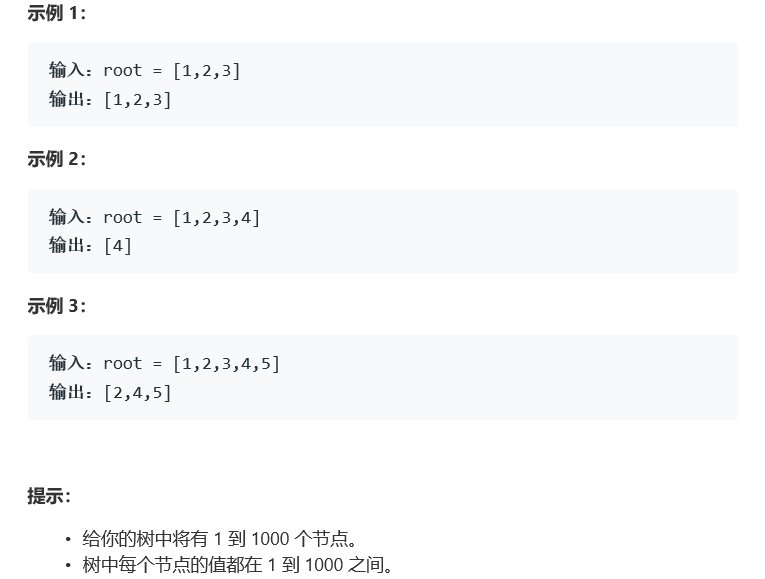

# 题目




# 算法

```python

```

```c++
/**
 * Definition for a binary tree node.
 * struct TreeNode {
 *     int val;
 *     TreeNode *left;
 *     TreeNode *right;
 *     TreeNode(int x) : val(x), left(NULL), right(NULL) {}
 * };
 */
class Solution {
public:
     /*TreeNode* lcaDeepestLeaves(TreeNode* root) {
       使用了类似于堆的线性表的方法来找父节点
        可行，但是超出时限
        if(root == nullptr || (root->left == nullptr && root->right == nullptr)){
            return root;
        }
        map<int,TreeNode*> tree;
        tree[1] = root;
        int max = 0,level = 2;
        for(auto t : tree){
            TreeNode* tmp = t.second;
            int num = t.first;
            if(num > max)
                max = num;
            if(tmp->left){
                tree[num*2] = tmp->left;
                if(num * 2 > max)
                    max = num*2;
            }
                
            if(tmp->right){
                if(num * 2 + 1 > max)
                    max = num*2 + 1;
                tree[num*2+1] = tmp->right;
            }
            if(max >= level)
                level*=2;
        }
        vector<int> deep;
        for(int i = level/2; i <= level; i++){
            if(tree.count(i))
                deep.push_back(i);
        }
        while(deep.size() > 1){
            int size = deep.size();
            int loc = 0;
            for(int i = 0; i < size; i++){
                deep[loc] = deep[i]/2;
                if(loc > 0 && deep[loc] == deep[loc-1])
                    loc--;
                loc++;
            }
            deep.erase(deep.begin()+loc,deep.end());
        }
        int res = deep[0];
        return tree[res];
    }
        */
    /*
    	核心点在于，公共父节点必定左右深度相同
    	否则，公共父节点必定在深的一边
    	你说这他妈的规律谁找得到？
    */
        int height(TreeNode* root){
            if(root == NULL) return 0;
            int l = height(root->left);
            int r = height(root->right);
            return max(l,r) + 1;
        }
        TreeNode* lcaDeepestLeaves(TreeNode* root) {
            if(root == NULL) return root;
            int l = height(root->left);
            int r = height(root->right);
            if(l == r) return root;
            if(l>r) return lcaDeepestLeaves(root->left);
            return lcaDeepestLeaves(root->right);
        }
};
```

