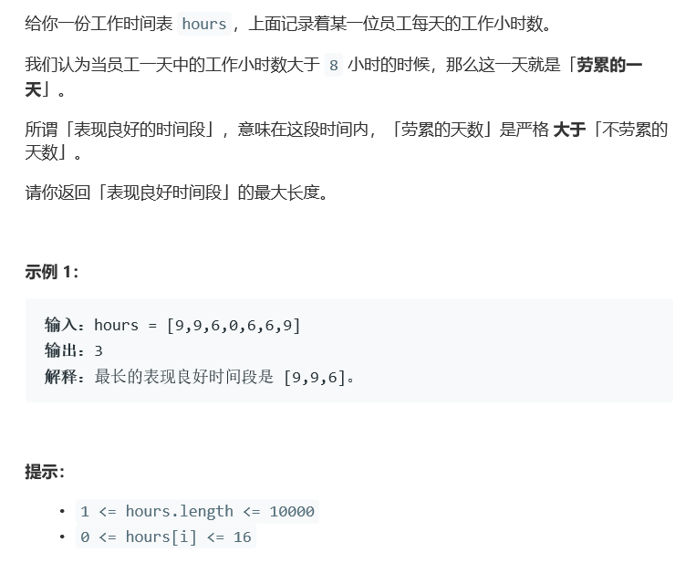

# 题目




# 算法

```python

```

```c++
class Solution {
public:
    /*int longestWPI(vector<int>& hours) {
        int max = 0, tired = 0, free = 0;
        for(auto a : hours){
            if(a > 8){
                tired++;
            }else{
                free++;
                if(tired < free){
                    tired = tired * 2 - 1;
                    if(max < tired)
                        max = tired;
                    tired = 0;
                    free = 0;
                }
            }
        }
        if(tired == free)
            tired = tired + free - 1;
        else
            tired += free;
        max = (max > tired)? max : tired;
        tired = 0, free = 0;
        for(int i = hours.size() - 1; i >= 0; i--){
            if(hours[i] > 8){
                tired++;
            }else{
                free++;
                if(tired < free){
                    tired = tired * 2 - 1;
                    if(max < tired)
                        max = tired;
                    tired = 0;
                    free = 0;
                }
            }
        }
        if(tired == free)
            tired = tired + free - 1;
        else
            tired += free;
        return (max > tired)? max : tired;
    }
    解决不了后面很大，所以前面部分可以包容的情况
    尝试使用过分别从左右两边的方法，还是回避不了
    */
    /*int longestWPI(vector<int>& hours) {
        int len=hours.size();
        int *a=new int[len+1];
        int max=0,index=-1;
        vector<int> vec;
        a[0]=0;
        vec.push_back(0);
        for(int i=0;i<len;i++){
            if(hours[i]>8){
                a[i+1]=a[i]+1;
            }
            else{
                a[i+1]=a[i]-1;
            }
            if(a[i+1]<a[vec.back()])
                vec.push_back(i+1);
        }
        for(int i=len;i>0&&!vec.empty();i--){
            if(i==vec.back()){
                vec.pop_back();
            }
            while(!vec.empty()&&a[i]-a[vec.back()]>0){
                index=vec.back();
                vec.pop_back();
            }
            if(i-index>max&&index!=-1)
                max=i-index;
        }
        return max;
    }
    单调栈的那个部分我没有看懂
    */
    int longestWPI(vector<int>& hours) {
		vector<int> tiring;
		int res = 0;
		for (int h : hours) {
			if (h > 8)
				tiring.push_back(1);
			else
				tiring.push_back(-1);
		}
		for (int i = 0; i < tiring.size(); i++) {
			int sum = 0;
			for (int j = i; j < tiring.size(); j++) {
				//int sum = accumulate(tiring.begin() + i, tiring.begin() + j + 1, 0);//Time Limit Exceeded
				sum += tiring[j];
				if ( sum > 0 && (j-i+1)>res) {
					res = j-i+1;
				}
			}
		}
		return res;
	}
        //[6,6,9] [6,9,6][9,9,6,0,6,6,9][6,9,9][8,12,7,6,10,10,9,11,12,6]
};
```

