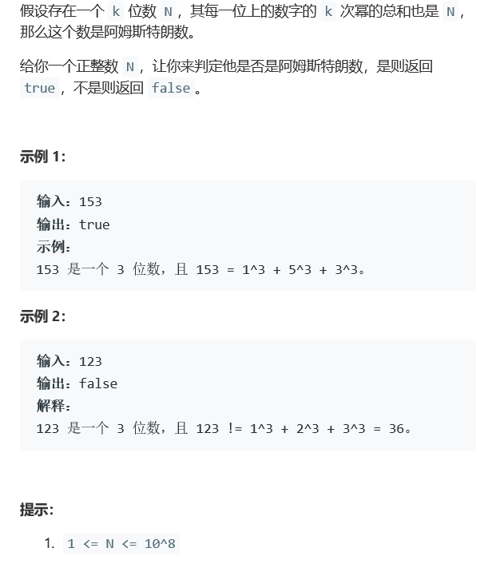

# 题目




# 算法

```python

```

```c++
class Solution {
public:
    int mul(int a,int b){
        int res = 1;
        while(a--)
            res *=b;
        return res;
    }
    bool isArmstrong(int N) {
        int num = 0,tmp = N,res = 0;
        vector<int> nums;
        while(N > 0){
            nums.push_back(N%10);
            num++;
            N/=10;
        }
        int mark = num;
        while(mark--){
            res += mul(num,nums[mark]);
        }
        cout<<res;
        return res == tmp;
    }
};
```


