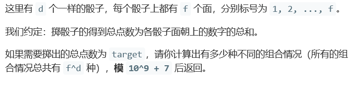
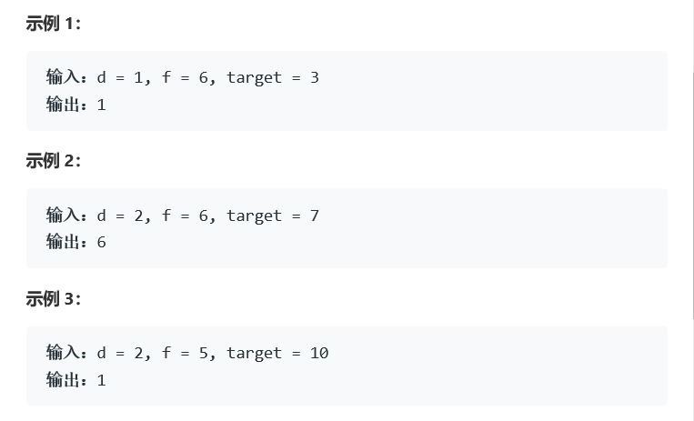
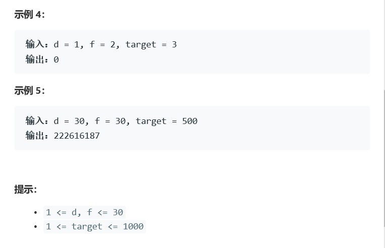
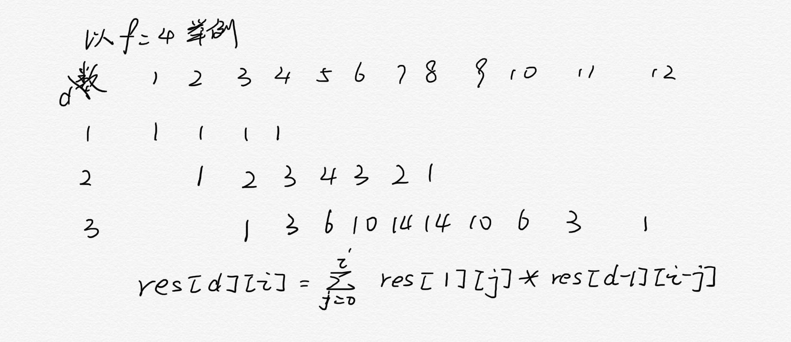

# 题目






# 算法

```python

```

```c++
class Solution {
public:
    int numRollsToTarget(int d, int f, int target) {
        if(target>d*f || target<d || d==0)
            return 0;
        if(d==1)
            return 1;
        int x=pow(10,9)+7;
        //取模运算不能在int和double之间进行，而pow输出的是double型
        int dp[target];
        //用dp的下标表示点数之和，值为方法数
        for(int k=0;k<min(f,target);k++)
            dp[k]=1;
        for(int i=1;i<d;i++){
            for(int j=min((i+1)*f,target)-1;j>=i;j--){
                //从后往前更新，因为后面的结果需要用到前一轮前面的结果
                dp[j]=0;
                for(int t=max(i-1,j-f);t<min(j,i*f);t++){
                    //注意t的上下界
                    dp[j]+=dp[t];
                    dp[j]=dp[j]%x;
                }
            }
        }
        return dp[target-1];
    }
};//这个是dp的算法
```

事实上还有一个简单公式



