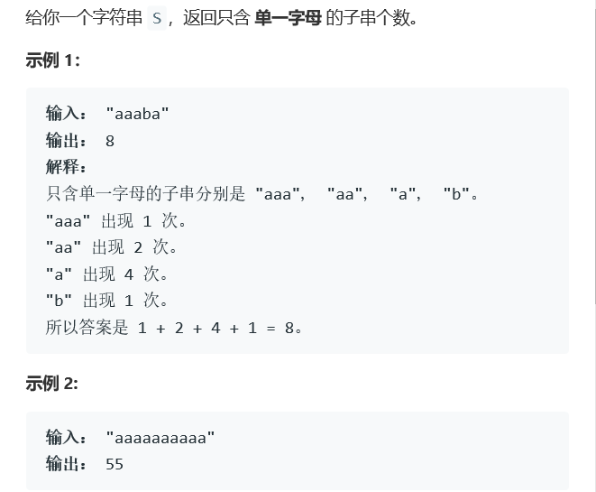
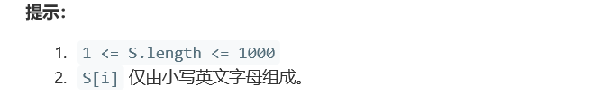

# 题目




# 算法

```python

```

```c++
class Solution {
public:
    int countLetters(string S) {
        int sum=0,cnt=1,flag=0;
        for(int i=0;i<S.length()-1;i++){
            if(S[i]==S[i+1]){cnt++;flag=0;}
            else{sum+=(1+cnt)*cnt/2;cnt=1;flag=1;}
            //"aaa"中 "a"出现3次 "aa"出现2次 "aaa"出现1次，也就是等差数列
        }
        if(flag==1){sum+=1;}
        if(flag==0){sum+=(1+cnt)*cnt/2;}
        return sum;
    }//纯数学做法
};
```

