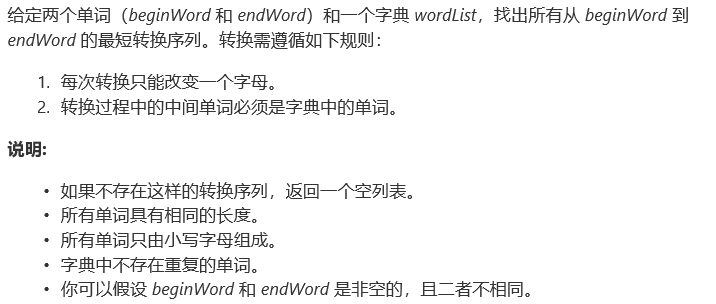
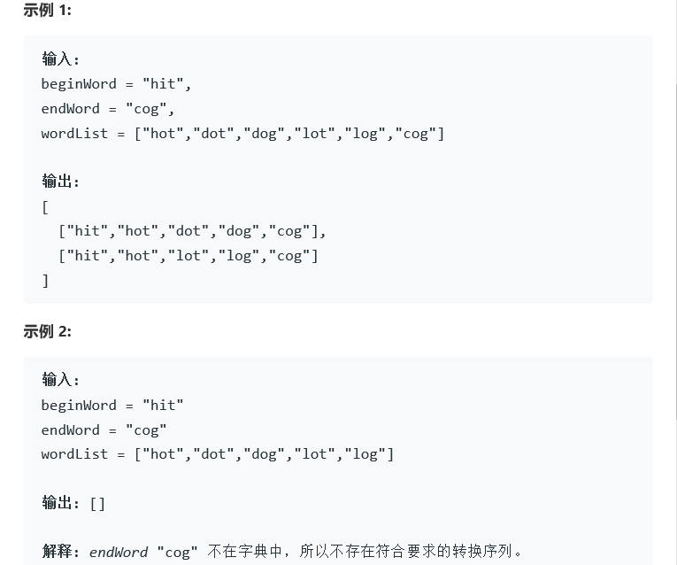

# 题目





# 算法

```python

```

```c++
class Solution {
public:
    int wordLength;
    bool calSim(const string& s1, const string& s2) {
        int res = 0;
        for (int i = 0; i < 6; ++i) {
            res += s1[i] == s2[i];
        }
        return res;
    }
    vector<vector<string>> findLadders(string beginWord, string endWord, vector<string>& wordList) {
        if(wordList.size() == 0 || endWord == "" || beginWord == " " || find(wordList.begin(), wordList.end(), endWord) ==  wordList.end())
            return {};
        int N = wordList.size();
        wordLength = wordList[0].length();
        vector<vector<bool>> sim(N, vector<bool>(N+1, false));
        //sim表示i和j之间的相似度
        for (int i = 0; i < N; ++i) {
            sim[i][i] = 6;
            int j; 
            for (j = i + 1; j < N; ++j) {
                sim[i][j] = sim[j][i] = calSim(wordList[i], wordList[j]);
            }
            sim[i][j] = calSim(wordList[i], beginWord);
        }
        int min_num = 0;
    }
};
```

