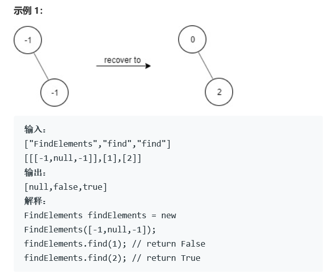
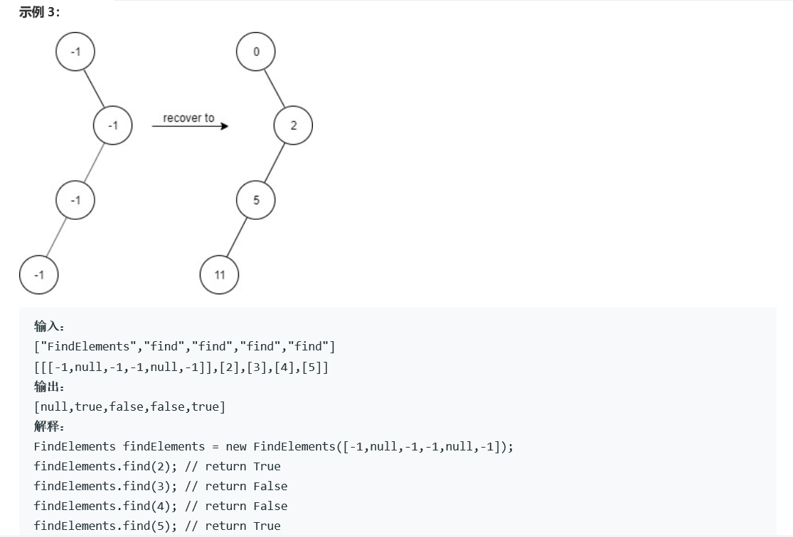

# 题目








# 算法

```python

```

```c++
/**
 * Definition for a binary tree node.
 * struct TreeNode {
 *     int val;
 *     TreeNode *left;
 *     TreeNode *right;
 *     TreeNode(int x) : val(x), left(NULL), right(NULL) {}
 * };
 */
class FindElements {
public:
    TreeNode* Root;
    set<int> list;
    void recover(TreeNode* root){
        int tmp = 2*root->val + 1;
        if(root->left){
            root->left->val = tmp;
            list.insert(tmp);
            recover(root->left);
        }
        if(root->right){
            root->right->val = tmp+1;
            list.insert(tmp+1);
            recover(root->right);
        }
    }
    FindElements(TreeNode* root) {
        Root = root;
        list.clear();
        Root->val = 0;
        list.insert(0);
        recover(Root);
    }
    
    bool find(int target) {
        return list.find(target)!=list.end();
    }
};

/**
 * Your FindElements object will be instantiated and called as such:
 * FindElements* obj = new FindElements(root);
 * bool param_1 = obj->find(target);
 */
```

下面是一个更棒的find算法

链接：https://leetcode-cn.com/problems/find-elements-in-a-contaminated-binary-tree/solution/bu-yong-setde-findfang-fa-by-cyanflxy/