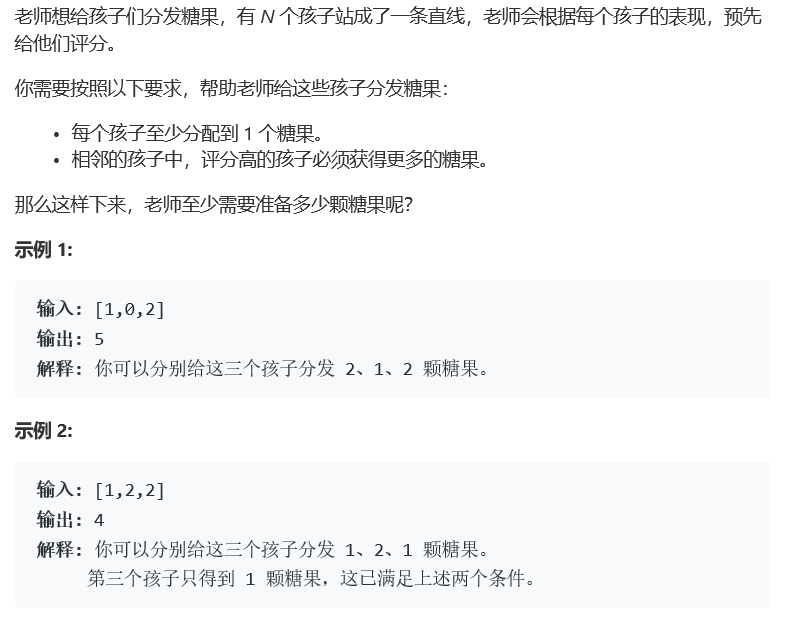

# 题目



# 算法

```python
class Solution:
    def candy(self, ratings: List[int]) -> int:
        if not ratings:
            return 0;
        num = len(ratings)
        cur,next,all = 0,1,0
        candy = [1]
        while cur < num:
            candy.append(1)
            if next < num:
                if ratings[cur] < ratings[next] :
                    candy[next] += candy[cur]+1
                def rever(self, candy: List[int], ratings: List[int], cur: int):
                    for i in range(cur):
                        if cur-i-1 >=0 and ratings[cur-i] < ratings[cur-i-1]:
                            candy[cur-i-1] += 1;
                        else:
                            break;
                if ratings[cur] > ratings[next]:
                    rever(self, candy, ratings, cur)
            else:
                def rever(self, candy: List[int], ratings: List[int], cur: int):
                    for i in range(cur):
                        if cur-i-1 >=0 and ratings[cur-i] < ratings[cur-i-1]:
                            candy[cur-i-1] += 1;
                        else:
                            break;
                rever(self, candy, ratings, cur)
            cur = next
            next += 1;
        candy.pop()
        for i in range(num):
            all += candy[i]
        return all;
```

不完善的算法，对于部分尾数会多加1.

