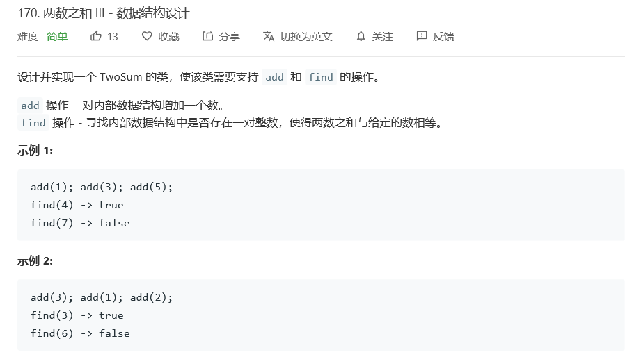

# 题目



# 算法

```python

```

```c++
class TwoSum {
private:
    vector<int> input;
public:
    /** Initialize your data structure here. */
    TwoSum() {
        input.clear();
    }
    
    /** Add the number to an internal data structure.. */
    void add(int number) {
        input.push_back(number);
        return;
    }
    
    /** Find if there exists any pair of numbers which sum is equal to the value. */
    bool find(int value) {
        sort(input.begin(),input.end());
        int begin = 0, end = input.size()-1;
        while(begin < end){
            int tmp = input[begin] + input[end];
            if(tmp == value)
                return true;
            if(tmp > value)
                end--;
            if(tmp < value)
                begin++;
        }
        return false;
    }
};

/**
 * Your TwoSum object will be instantiated and called as such:
 * TwoSum* obj = new TwoSum();
 * obj->add(number);
 * bool param_2 = obj->find(value);
 */
```

