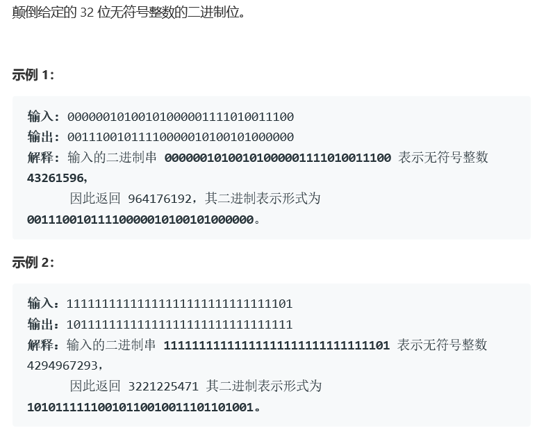
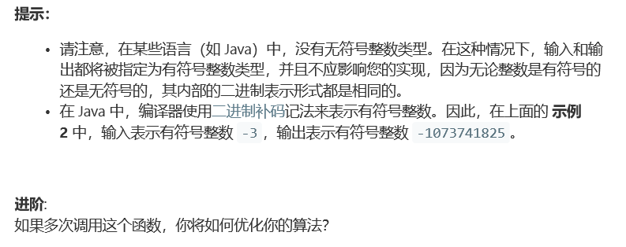

# 题目





# 算法

```python
class Solution:
    def reverseBits(self, n: int) -> int:
        res = bin(n)[2:] #将n转换成2进制形式，并且去除前缀0b
        res = res.zfill(32)#在二进制左侧填充0，使得长度为32位
        res = res[::-1]# 反转二进制
        return int(res,base=2)#将二进制转换为整数
```

```c++
class Solution {
public:
    uint32_t reverseBits(uint32_t n) {
        uint32_t res = 0; int i = 0;
        while(i < 32){
            int tmp = n%2;
            res = res | tmp;
            if(i < 31)
                res = res << 1;
            n /=2 ;
            i++;
        }
        return res;
    }
};
```

c++解法的简单方法在于，依次逐位对二进制数进行操作和左偏移。注意一点，最后一次不需要偏移。

同时，两种算法对比之后发现，python的反向放入和转换的方法，效率真的是低，同时占用大量的空间。