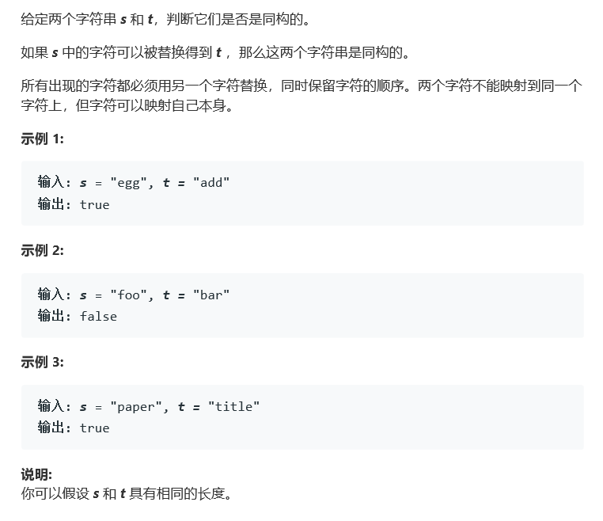

# 题目




# 算法

```python

```

```c++
class Solution {
public:
    bool isIsomorphic(string s, string t) {
        map<char,char> dic;
        map<char,char> dic1;
        int ssize = s.length(), tsize = t.length();
        for(int i = 0; i < ssize; i++){
            if(dic.count(s[i])){
                if(t[i] != dic[s[i]])
                    return false;
            }else{
                dic[s[i]] = t[i];
            }
            if(dic1.count(t[i])){
                if(s[i] != dic1[t[i]])
                    return false;
            }else{
                dic1[t[i]] = s[i];
            }
        }
        return true;
    }
};
```

class Solution {
public:
    bool isIsomorphic(string s, string t) {
        for(int i=0;i<s.size();i++){
            if(s.find(s[i])!=t.find(t[i]))
            return false;
        }
        return true;
    }
};

作者：youlookdeliciousc
链接：https://leetcode-cn.com/problems/isomorphic-strings/solution/cxiang-xi-ti-jie-shuang-jie-by-youlookdeliciousc/
来源：力扣（LeetCode）
著作权归作者所有。商业转载请联系作者获得授权，非商业转载请注明出处。