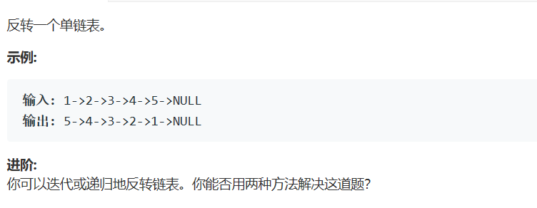

# 题目



# 算法

双指针回溯。

```python
# Definition for singly-linked list.
# class ListNode:
#     def __init__(self, x):
#         self.val = x
#         self.next = None

class Solution:
    def reverseList(self, head: ListNode) -> ListNode:
        if not head:
            return None
        pre,cur,next = None,None,None
        cur = head;
        while cur :
            next = cur.next
            cur.next = pre
            pre = cur
            cur = next
        return pre 
```

第一眼看到这个题目想要使用的就是栈，但是python里面似乎没有天然的栈结构。

此处改为使用双指针，时间复杂度 O(n),空间复杂度O(1)

