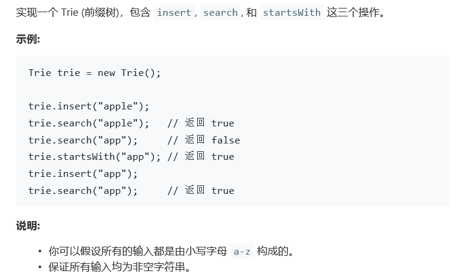

# 题目




# 算法

```python

```

```c++

class Trie {
private:
    bool isEnd;
    Trie* next[26];
public:
    /** Initialize your data structure here. */
    Trie() {
        isEnd = false;
        memset(next, 0, sizeof(next));
    }
    
    /** Inserts a word into the trie. */
    void insert(string word) {
        Trie* n = this;
        for(char a : word){
            if(n->next[a-'a'] == nullptr)
                n->next[a-'a'] = new Trie();
            n = n->next[a-'a'];
        }
        n->isEnd = true;
    }
    
    /** Returns if the word is in the trie. */
    bool search(string word) {
        Trie* n = this;
        for(char a : word){
            if(n->next[a-'a'] == nullptr)
                return false;
            n = n->next[a-'a'];
        }
        return n->isEnd;
    }
    
    /** Returns if there is any word in the trie that starts with the given prefix. */
    bool startsWith(string prefix) {
        Trie* n = this;
        for(char a : prefix){
            if(n->next[a-'a'] == nullptr)
                return false;
            n = n->next[a-'a'];
        }
        return true;
    }
};

/**
 * Your Trie object will be instantiated and called as such:
 * Trie* obj = new Trie();
 * obj->insert(word);
 * bool param_2 = obj->search(word);
 * bool param_3 = obj->startsWith(prefix);
 */
```

```c++
//一样是c++不知道这个为什么最后一个测试过不了
class TrieNode{
    private:
        bool isEnd;
        TrieNode* next[26];
    public:
        TrieNode(){
            isEnd = false;
            for(int i = 0; i < 26; i++)
                next[i] = nullptr;
        }
        void insert(string& s, int i){
            int tmp = s[i]-'a';
            if(next[tmp] == nullptr){
                next[tmp] = new TrieNode();
            }
            if(i == s.size()-1)
                isEnd = true;
            else{
                next[tmp]->insert(s, i+1);
            }
        }
        bool search(string& s, int i){
            int tmp = s[i]-'a';
            if(next[tmp] == nullptr){
                return false;
            }
            if(i == s.size()-1 && isEnd)
                return true;
            else{
                return next[tmp]->search(s, i+1);
            }
        }
        
        bool startsWith(string& s, int i){
            int tmp = s[i]-'a';
            if(next[tmp] == nullptr){
                return false;
            }
            if(i == s.size()-1)
                return true;
            else{
                return next[tmp]->startsWith(s, i+1);
            }
        }
};
class Trie {
private:
    TrieNode* root;
public:
    /** Initialize your data structure here. */
    Trie() {
        root = new TrieNode();
    }
    
    /** Inserts a word into the trie. */
    void insert(string word) {
        root->insert(word,0);
    }
    
    /** Returns if the word is in the trie. */
    bool search(string word) {
        if(word == "")
            return true;
        return root->search(word, 0);
    }
    
    /** Returns if there is any word in the trie that starts with the given prefix. */
    bool startsWith(string prefix) {
        if(prefix == "")
            return true;
        return root->startsWith(prefix, 0);
    }
};

/**
 * Your Trie object will be instantiated and called as such:
 * Trie* obj = new Trie();
 * obj->insert(word);
 * bool param_2 = obj->search(word);
 * bool param_3 = obj->startsWith(prefix);
 */
```

