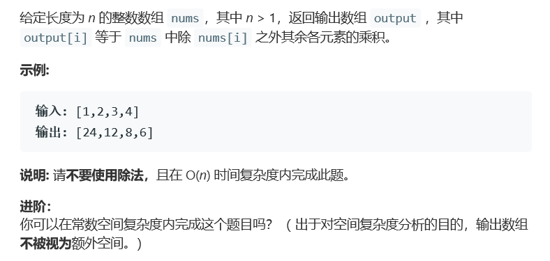

# 题目



# 算法

```python

```

```c++
class Solution {
public:
    vector<int> productExceptSelf(vector<int>& nums) {
        vector<int> left,right;
        int size = nums.size(), mul = 1;
        for(int i = 0; i < size; i++){
            left.push_back(mul);
            mul *= nums[i];
        }
        mul = 1;
        for(int i = size - 1; i >= 0; i--){
            right.push_back(mul);
            mul *= nums[i];
        }
        for(int i = 0; i < size; i++){
            nums[i] = left[i] * right[size - i - 1];
        }
        return nums;
    }
};
```

