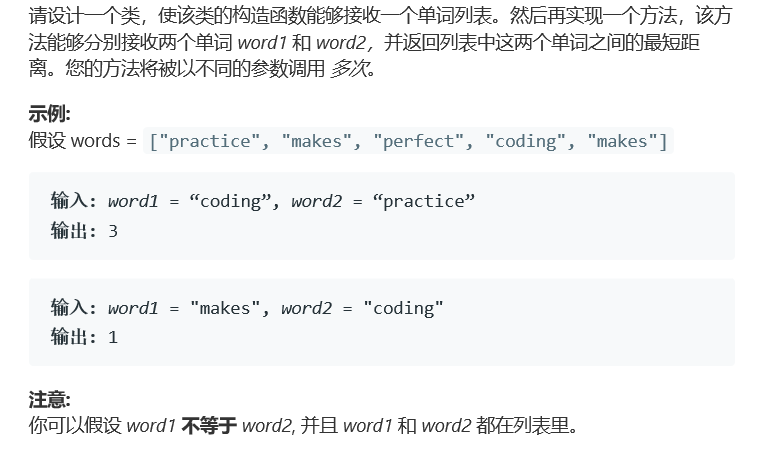

# 题目




# 算法

```python

```

```c++
class WordDistance {
public:
    unordered_map<string, vector<int> > indices;
    WordDistance(vector<string>& words) {
        for (int i = 0; i < words.size(); ++i) {
            indices[words[i]].push_back(i);
        }
    }
    
    int shortest(string word1, string word2) {
        auto& v1 = indices[word1];
        auto& v2 = indices[word2];
        int i = 0;
        int j = 0;
        int res = INT_MAX;
        while (i < v1.size() && j < v2.size()) {
            if (v1[i] <= v2[j]) {
                res = min(res, v2[j] - v1[i]);
                ++i;
            } else {
                res = min(res, v1[i] - v2[j]);
                ++j;
            }
        }
        return res;
    }
};

/**
 * Your WordDistance object will be instantiated and called as such:
 * WordDistance* obj = new WordDistance(words);
 * int param_1 = obj->shortest(word1,word2);
 */
```

