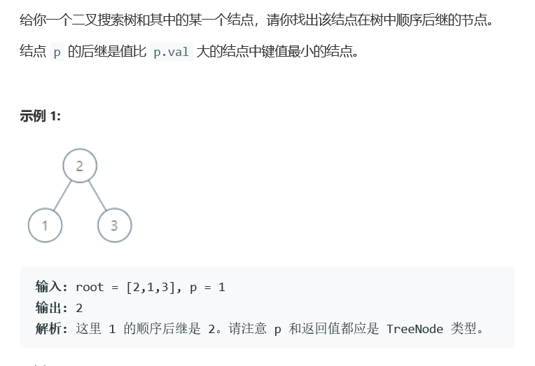
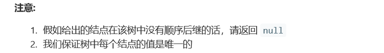

# 题目






# 算法

```python

```

```c++
/**
 * Definition for a binary tree node.
 * struct TreeNode {
 *     int val;
 *     TreeNode *left;
 *     TreeNode *right;
 *     TreeNode(int x) : val(x), left(NULL), right(NULL) {}
 * };
 */
class Solution {
public:
    TreeNode* findParent(TreeNode* root, TreeNode* p) {
        if(root == nullptr || root->left == p || root->right == p)
            return root;
        if(root->val > p->val)
            return findParent(root->left, p);
        return findParent(root->right, p);
    }
    TreeNode* min(TreeNode* root) {
        if(root->left != nullptr)
            return min(root->left);
        else
            return root;
    }
    TreeNode* inorderSuccessor(TreeNode* root, TreeNode* p) {
        if(p->right != nullptr)
            return min(p->right);
        TreeNode* parent = findParent(root, p);
        if(parent == nullptr)
            return parent;
        if(parent->left == p)
            return parent;
        while(parent && parent->val < p->val)
            parent = findParent(root, parent);
        return parent;
    }
};
```

特例：

* **[0] 0** 		 p右边没了
* **[5,3,6,2,4,null,null,1] 6**  
*  **[41,37,44,24,39,42,48,1,35,38,40,null,43,46,49,0,2,30,36,null,null,null,null,null,null,45,47,null,null,null,null,null,4,29,32,null,null,null,null,null,null,3,9,26,null,31,34,null,null,7,11,25,27,null,null,33,null,6,8,10,16,null,null,null,28,null,null,5,null,null,null,null,null,15,19,null,null,null,null,12,null,18,20,null,13,17,null,null,22,null,14,null,null,21,23] 40**  多等父节点迭代