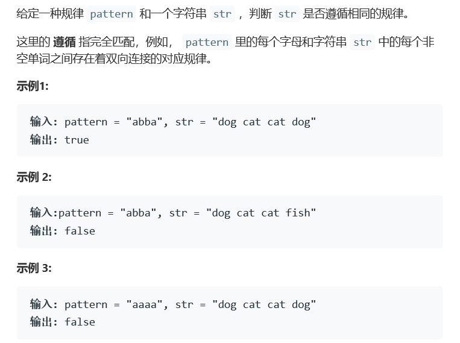
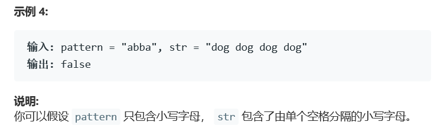

# 题目




# 算法

```python

```

```c++
class Solution {
public:
    bool wordPattern(string pattern, string str) {
        char tmpChar;
        int length = pattern.length(),loc = 0;
        string tmpString;
        str += ' ';
        map<char,string> dictionary;
        set<string> mark;
        stringstream is(str);
        while(getline(is,tmpString,' ') ){
            if(loc == length)
                return false;
            tmpChar = pattern[loc];
            if(dictionary.count(tmpChar)){
                if(dictionary[tmpChar] != tmpString)
                    return false;
            } else{
                if(mark.find(tmpString) != mark.end()){
                    return false;
                }else{
                    dictionary[tmpChar] = tmpString;
                    mark.insert(tmpString);
                }
            }
            loc++;
        }
        if(loc != length )
            return false;
        return true;
    }
};
/*
	特殊情况注意	
		1）ab不能相等
		2）pattern 和 str 可能有长度问题
*/
```

