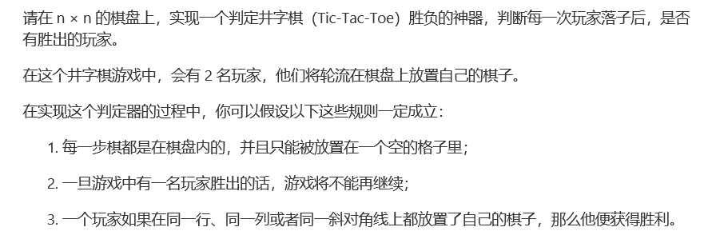
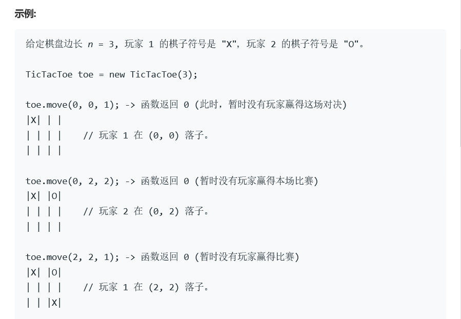
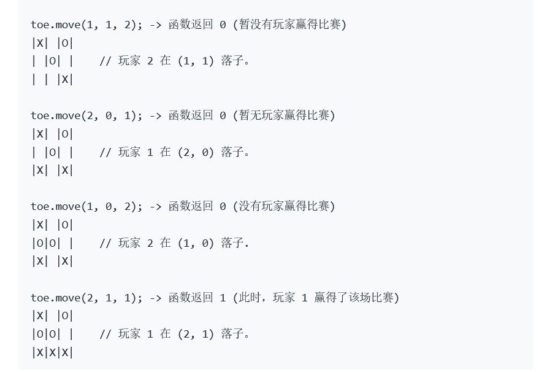
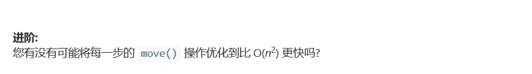

# 题目








# 算法

```python

```

```c++
class TicTacToe {
public:
    /** Initialize your data structure here. */
    int *board, *row, *col, *cross,num;
    TicTacToe(int n) {
        num = n; 
        board = new int[n*n];
        row = new int[n];
        col = new int[n];
        cross = new int[2];
        int i;
        for(i = 0; i < n; i++){
            row[i] = 0;
            col[i] = 0;
            board[i] = 0;
        }
        cross[0] = 0, cross[1] = 0;
        for(; i < n*n; i++){
            board[i] = 0;
        }
    }
    
    /** Player {player} makes a move at ({row}, {col}).
        @param row The row of the board.
        @param col The column of the board.
        @param player The player, can be either 1 or 2.
        @return The current winning condition, can be either:
                0: No one wins.
                1: Player 1 wins.
                2: Player 2 wins. */
    int move(int row1, int col1, int player) {
        switch(row[row1]){
            case 0:
                row[row1] = player;
                break;
            case 1:
            case 2:
                if(row[row1] != player)
                    row[row1] += player;
                break;
            case 3:
                break;
        }
        switch(col[col1]){
            case 0:
                col[col1] = player;
                break;
            case 1:
            case 2:
                if(col[col1] != player)
                    col[col1] += player;
                break;
            case 3:
                break;
        }
        if(row1 == col1){
            switch(cross[0]){
                case 0:
                    cross[0] = player;
                    break;
                case 1:
                case 2:
                    if(cross[0] != player)
                        cross[0] += player;
                    break;
                case 3:
                    break;
            }
        }
        if(row1 + col1 == num-1){
            switch(cross[1]){
                case 0:
                    cross[1] = player;
                    break;
                case 1:
                case 2:
                    if(cross[1] != player)
                        cross[1] += player;
                    break;
                case 3:
                    break;
            }
        }
        board[row1*num + col1] = player;
        /*for(int i = 0; i < num*num;i++)
            cout<<board[i];
        cout<<endl;
        cout<<row[row1]<<"r"<<col[col1]<<"c"<<cross[0]<<cross[1]<<endl;*/
        bool win = true;
        if(row[row1] == player){
            for(int i = 0; i < num; i++){
                if(board[i + row1*num] != player){
                    win = false;
                    break;
                }
            }
            if(win)
                return player;
            else
                win = true;
        }
        if(col[col1] == player){
            for(int i = 0; i < num; i++){
                if(board[i*num + col1] != player){
                    win = false;
                    break;
                }
            }
            if(win)
                return player;
            else
                win = true;
        }
        if(row1  == col1){
            if(cross[0] == player){
                for(int i = 0; i < num; i++)
                    if(board[i*num+i] != player){
                        win = false;
                        break;
                    }
                if(win)
                    return player;
                else
                    win = false;
            }
        }
        if(row1 + col1 == num-1){
            if(cross[1] == player){
                for(int i = 0; i < num; i++)
                    if(board[i*num+num - i - 1] != player){
                        win = false;
                        break;
                    }
                if(win)
                    return player;
                else
                    win = false;
            }
        }
        return 0;
    }
};

/**
 * Your TicTacToe object will be instantiated and called as such:
 * TicTacToe* obj = new TicTacToe(n);
 * int param_1 = obj->move(row,col,player);
 */
```

