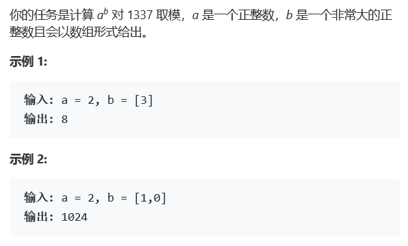

# 题目




# 算法

```python

```

```c++
class Solution {
public:
int base = 1337;
int mypow(int a, int k) {
    if (k == 0) return 1;
    a %= base;

    if (k % 2 == 1) {
        // k 是奇数
        return (a * mypow(a, k - 1)) % base;
    } else {
        // k 是偶数
        int sub = mypow(a, k / 2);
        return (sub * sub) % base;
    }
}
int superPow(int a, vector<int>& b) {
    if (b.empty()) return 1;
    int last = b.back();
    b.pop_back();
    
    int part1 = mypow(a, last);
    int part2 = mypow(superPow(a, b), 10);
    // 每次乘法都要求模
    return (part1 * part2) % base;
}
};
```


