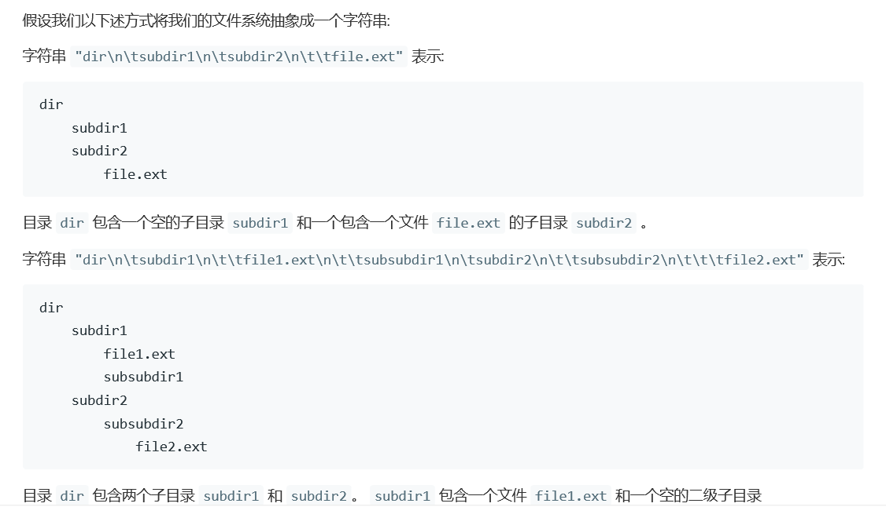
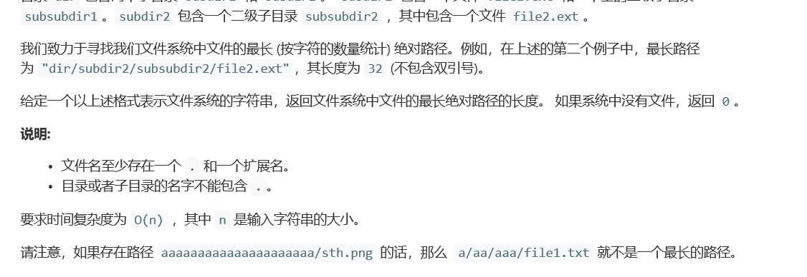

# 题目




# 算法

```python

```

```c++
class Solution {
public:
    int lengthLongestPath(string input) {
        int res = 0;
        int n = input.size();
        stack<pair<string, int>> st;
        // for (int i = 0; i < input.size(); i++) cout << input[i];
        int ind = 0;
        bool flag1 = false;
        while (ind < n && input[ind] != '\n') {
            if (input[ind] == '.') flag1 = true;
            ind++;
        }
        if (flag1) res = ind;
        int tmp = 0;
        st.push({input.substr(0, ind), 0});
        tmp = st.top().first.size();

        while (ind < n) {
            // 跳过\n
            ind++;
            // 记录当前字符串开头多少个\t
            int t = 0;
            while (ind < n && input[ind] == '\t') {
                ind++;
                t++;
            }

            // 记录当前是否是一个文件
            bool flag = false;
            // 当前字符串的开始位置及长度
            int ks = ind, ln = 0;
            while (ind < n && input[ind] != '\n') {
                if (input[ind] == '.') flag = true;
                ind++; ln++;
            }
            string now = input.substr(ks, ln);
            
            // 移除栈中\t数小于等于当前\t数的元素
            while (!st.empty() && st.top().second >= t) {
                pair<string, int> tp = st.top(); st.pop();
                // 栈中总字符数减少
                tmp -= tp.first.size();
            }
            st.push({now, t});
            tmp += now.size();

            // 如果当前是个文件，更新结果
            if (flag) {
                int tmp_res = tmp + st.size() - 1;
                res = max(res, tmp_res);
            }
        }

        
        return res;
    }
};//使用stringstream，同时使用getline加‘\’作为间隔符会减少一部分工作量
```

