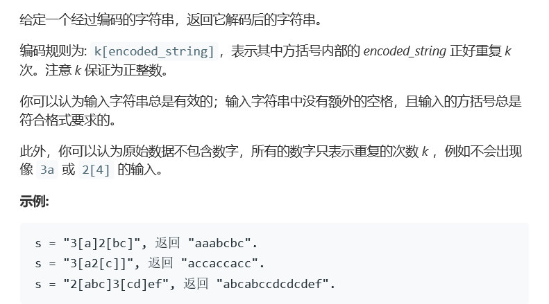

# 题目




# 算法

```python

```

```c++
class Solution
{
public:
    /*
     * 双栈处理，一个栈放数字，一个栈放字符串，然后逐个退栈后叠加到输出字符串中
     */
    string decodeString(string s)
    {
        vector<int> dataStk;
        vector<string> strStack;

        int num = 0;
        string strTemp = "";

        for (int i = 0; i < s.length(); ++i)
        {
            char temp = s[i];

            // 把当前累加的数字计算出来
            if (isdigit(temp))
            {
                num = num * 10 + temp - '0';
                continue;
            }

            // 叠加字符串
            if (isalpha(temp))
            {
                strTemp.push_back(temp);
                continue;
            }

            // 当出现“[”时处理数字和字符串，其中0和空串也要入栈，否则后面出栈就会出现不匹配问题
            if (temp == '[')
            {
                dataStk.push_back(num);
                num = 0;

                strStack.push_back(strTemp);
                strTemp = "";

                continue;
            }

            // 当遇到“]”时计算结果
            // 1、把数字出栈，根据数字输出字符串；2、字符串栈出栈，把当前的字符串累加上去
            if (temp == ']')
            {
                int count = dataStk.back();
                dataStk.pop_back();
                string resTemp = strTemp;
                for (int k = 1; k < count; k++)
                {
                    resTemp.append(strTemp);
                }

                strTemp = strStack.back() + resTemp;
                strStack.pop_back();
            }
        }

        return strTemp;
    }
};
```

