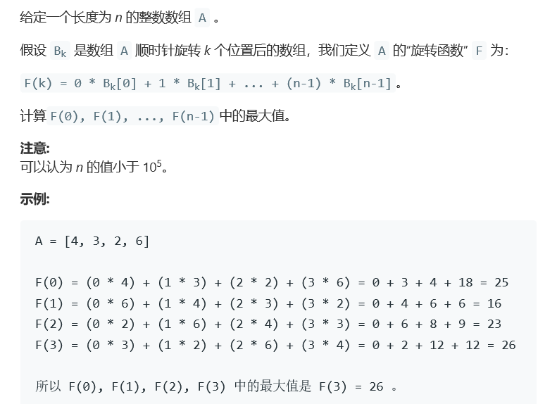
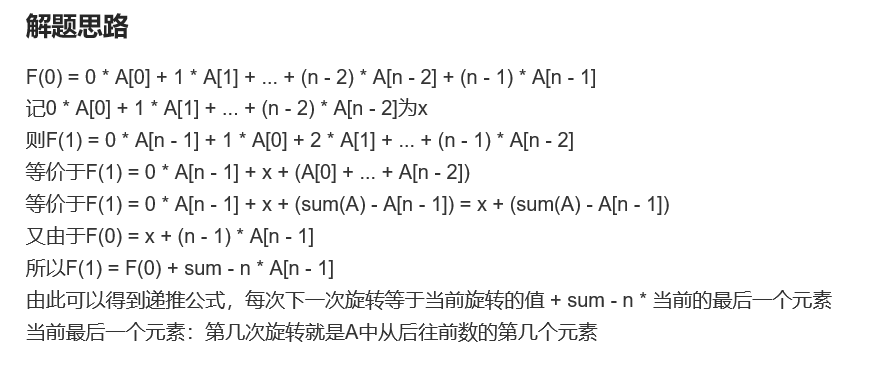

# 题目




# 算法

```python

```



```c++
class Solution {
public:
    int maxRotateFunction(vector<int>& A) {
        /*
        如果要找最大值，那么显然我们要把最大的乘以n-1，尽可能的把连续的最大值往后放 
        方法有问题，例如示例就没有办法解决这个问题。
         
        int size = A.size(),res = 0, max = INT_MIN, loc;
        if(size < 2)
            return 0;
        vector<int> maxLoc;
        for(int i = 0; i < size; i++){
            if(A[i] > max){
                max = A[i];
                maxLoc.clear();
                maxLoc.push_back(i);
            }else if(A[i] == max){
                maxLoc.push_back(i);
            }//找到最大值，同时记录最大值位置。
        }

        //因为空vector已经处理过了，这里的maxLoc必定有值
        if(maxLoc.size() == 1){
            //唯一最大值情况
            loc = maxLoc[0];
        }else{
            //找连续最多的位置，把他们放在最后
            int length = 0, loc = 0, maxsize = maxLoc.size();
            //1，3，5，6，7，

            for(int i = 0; i < maxsize; i++){
                int tmp = 0;
                while(i < maxsize-1){
                    if(maxLoc[i] + 1 == maxLoc[i+1]){
                        tmp++;
                        i++;
                    }else{
                        if(tmp > length){
                            length = tmp;
                            loc = i;
                        }
                        tmp = 0;
                        break;
                    }
                }
            }
        }
        cout<<"loc "<<loc;
        for(int i = 1; i <= size; i++ ){
            int tmp = (i-1)*A[(loc+i)%size];
            cout<<" i "<<i<<" tmp "<<tmp;
            res+=tmp;
        }
        return res;
        */

        /*
            暴力方法，示例超时时间限制
        int size = A.size(),res = 0;
        if(size < 2)
            return 0;
        for(int i = 0; i < size; i++){
            int tmp = 0;
            for(int j = 0; j < size; i++){
                tmp += (j)*A[(i+j)%size];
            }
            res = max(res,tmp);
        }
        return res;
        */
        long long tmp = 0;
        long long sum = 0;
        for (int i = 0; i < A.size(); i++) {
            tmp += i * A[i];
            sum += A[i];
        }
        long long res = tmp;
        for (int i = 1; i < A.size(); i++) {
            tmp = tmp + sum - A.size() * A[A.size() - i];
            res = max(res, tmp);
        }

        return int(res);
    }
};
```

