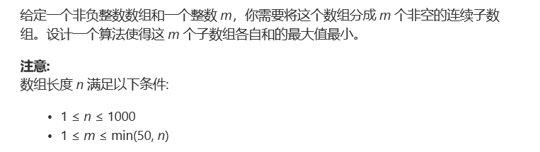
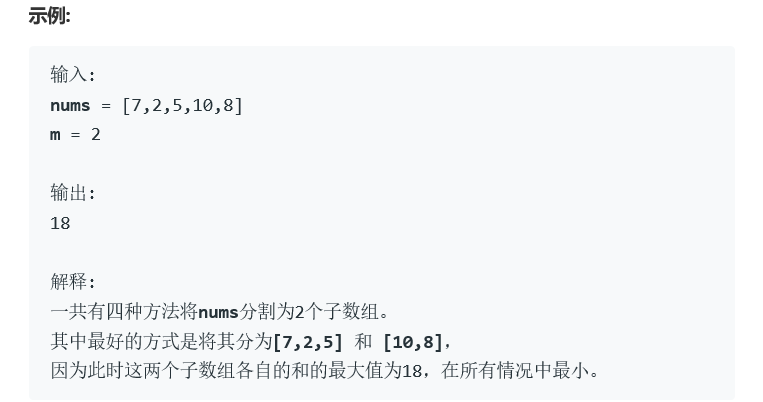

# 题目




# 算法

```python

```

```c++
class Solution0 {
    //失败作品1，简单的递归方法，没有进行剪枝和记录，通过14/27，超出时间限制
public:
    int size;
    int split(vector<int>& nums, int loc, int m){
        if(m == 1){
            int res = 0;
            for(int i = loc; i < size; i++)
                res += nums[i];
            return res;
        }
        int res = INT_MAX, tmp = 0;
        for(int i = loc; i <= size-m; i++){
            tmp += nums[i];
            int rest = split(nums,i+1,m-1);
            res = min(res,max(tmp,rest));
            //cout<<"loc"<<loc<<" i"<<i<<" rest"<<rest<<" tmp"<<tmp<<" res"<<res<<endl;
        }
        return res;
    }
    int splitArray(vector<int>& nums, int m) {
        //重点在于连续的数组，也就是说可以使用dp来做，也可以使用迭代(分治)来完成
        size = nums.size();
        return split(nums,0,m);
    }
};
```

