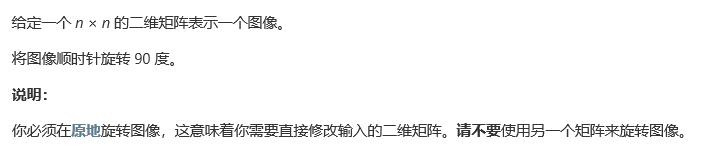
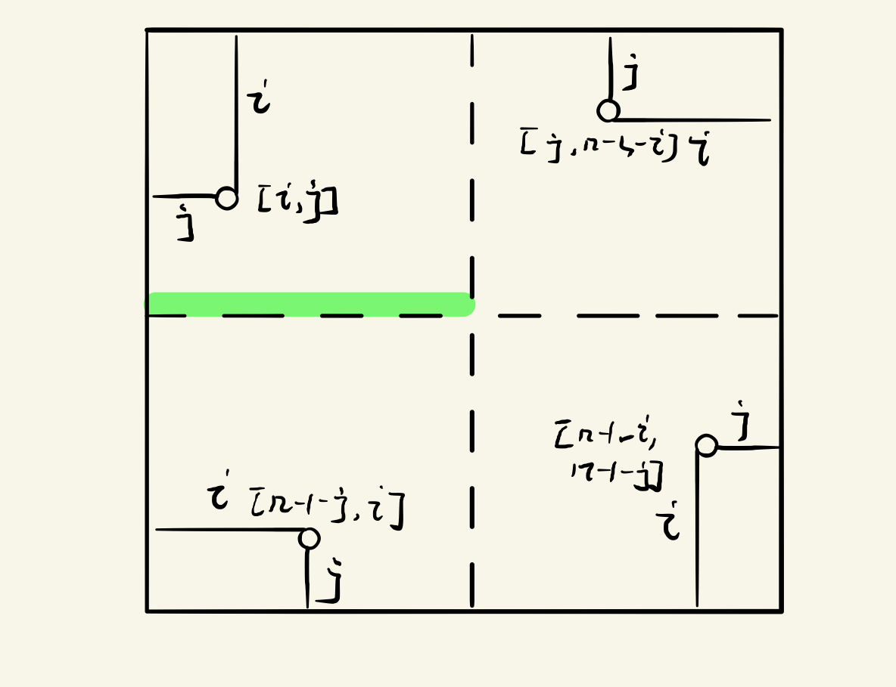

# 题目

# 原始算法
```
class Solution {
public:
    void rotate(vector<vector<int>>& matrix) {
        int n = matrix.size();
        int mid = (n == n/2*2)? n/2:(n/2+1);
        for(int i = 0; i < mid; i++){
            for(int j = 0; j < n/2; j++){
                int tmp = matrix[i][j];
                matrix[i][j] = matrix[n-1-j][i];
                matrix[n-1-j][i] = matrix[n-1-i][n-1-j];
                matrix[n-1-i][n-1-j] = matrix[j][n-1-i];
                matrix[j][n-1-i] = tmp;
            }
        }
    }
};
```
## 思路  
* 算法本质上是人类思维，同时进行分块。没有进行算法优化，在人类思维上，我们需要选定特定的点 ( i , j )，进行转换，如下图。

* 此处注意点，n为奇数是，模块A的左下最后一行，不需要进行转换（可以使用n/2)来处理。
>因为如果 i， j都按照mid处理，这一行会被重复处理两次，造成数据错误。

