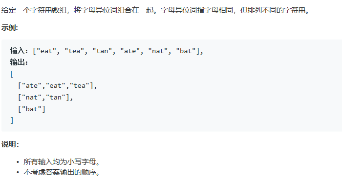

# 题目

# 原始算法
```
class Solution {
public:
    vector<vector<string>> groupAnagrams(vector<string>& strs) {
        map<string,vector<string> > ma;
        vector<vector<string>> res;
        for(auto str:strs){
            string tmp = str;
            sort(tmp.begin(),tmp.end());
            ma[tmp].push_back(str);
        }
        for(const auto& m:ma)
            res.push_back(m.second);
        return res;
    }
};
```
## 思路  
* 算法采用哈希表的方法进行队列选择。  
** 使用map来存储键值对
** 使用string的有序排列作为key  
  
  
  
# 改进算法
```
class Solution {
public:
    vector<vector<string>> groupAnagrams(vector<string>& strs) {
        map<int,vector<string> > ma;
        vector<vector<string>> res;
        int prime[26] = {2,3,5,7,11,13,17,19,23,29,31,37,41,43,47,53,59,61,67,71,73,79,83,89,97,101};
        for(auto str:strs){
            int tmp = 1;
            for(int i = 0; i < str.length(); i++){
                tmp *= prime[str[i] - 'a'];
            }
            ma[tmp].push_back(str);
        }
        for(const auto& m:ma)
            res.push_back(m.second);
        return res;
    }
};
```
## 思路：利用数学设计键
>算术基本定理，又称为正整数的唯一分解定理，即：每个大于1的自然数，要么本身就是质数，要么可以写为2个以上的质数的积，而且这些质因子按大小排列之后，写法仅有一种方式。
*  可以利用这一点映射字符串，来构造键值，根本上这个方法与原始方法没有什么不同，但是这一过程通过简化键值的设计，达成了算法时间复杂度的优化。

* 但事实上这个算法有一个极大的问题，就是因为素数的限制，int 容易溢出

# 算法3
	通过string作为计数器的方式，进行类似于 0#0#0这种方式作为key
