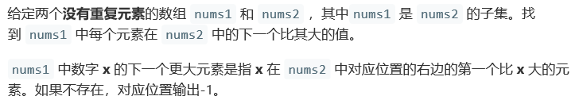
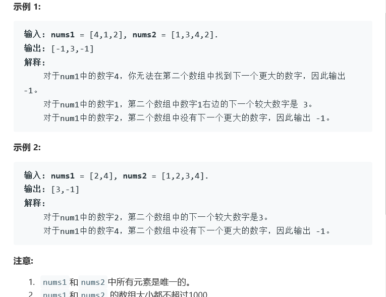

# 题目


 

# 算法

```java
public class Solution {
    public int[] nextGreaterElement(int[] findNums, int[] nums) {
        Stack < Integer > stack = new Stack < > ();
        HashMap < Integer, Integer > map = new HashMap < > ();
        int[] res = new int[findNums.length];
        for (int i = 0; i < nums.length; i++) {
            while (!stack.empty() && nums[i] > stack.peek())
                map.put(stack.pop(), nums[i]);
            stack.push(nums[i]);
        }
        while (!stack.empty())
            map.put(stack.pop(), -1);
        for (int i = 0; i < findNums.length; i++) {
            res[i] = map.get(findNums[i]);
        }
        return res;
    }
}

//单调栈牛逼

作者：LeetCode
链接：https://leetcode-cn.com/problems/next-greater-element-i/solution/xia-yi-ge-geng-da-yuan-su-i-by-leetcode/
来源：力扣（LeetCode）
著作权归作者所有。商业转载请联系作者获得授权，非商业转载请注明出处。
```

```c++

```

