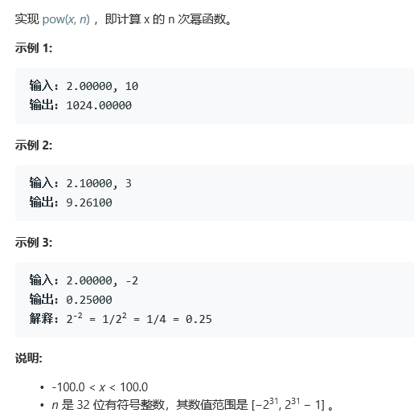

# 题目




# 算法

## 原始算法

```
class Solution {
public:
    double myPow(double x, int n) {
        long long N = n;
        if (N < 0) {
            x = 1 / x;
            N = -N;
        }
        double ans = 1;
        for (long long i = 0; i < N; i++)
            ans = ans * x;
        return ans;
    }
};
```

* 简单的依次乘法，问题在于
  * 1、此算法的事件复杂度仅为O(n), 极易超出事件
  * 2、同时此种算法，在N为负数的时候直接将数字进行了反转，极限情况下，并不满足实际情况


## 改进算法

​	根据类似`动态规划`的计算结果重复使用的算法

```
class Solution {
public:
    double fastPow(double x, long long n) {
        if (n == 0) {
            return 1.0;
        }
        double half = fastPow(x, n / 2);
        if (n % 2 == 0) {
            return half * half;
        } else {
            return half * half * x;
        }
    }
    double myPow(double x, int n) {
        long long N = n;
        if (N < 0) {
            x = 1 / x;
            N = -N;
        }
        return fastPow(x, N);
    }
};
```

对n/2的情况进行了复用（递归的形式）。

```
C++Javaclass Solution {
public:
    double myPow(double x, int n) {
        long long N = n;
        if (N < 0) {
            x = 1 / x;
            N = -N;
        }
        double ans = 1;
        double current_product = x;
        for (long long i = N; i ; i /= 2) {
            if ((i % 2) == 1) {
                ans = ans * current_product;
            }
            current_product = current_product * current_product;
        }
        return ans;
    }
};
```

非递归形式

