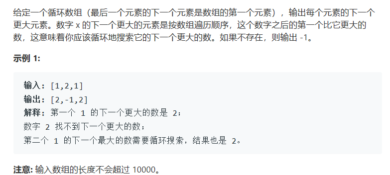

# 题目




# 算法

```java
public class Solution {
    public int[] nextGreaterElements(int[] nums) {
        int[] res = new int[nums.length];
        Stack<Integer> stack = new Stack<>();
        for (int i = 2 * nums.length - 1; i >= 0; --i) {
            while (!stack.empty() && nums[stack.peek()] <= nums[i % nums.length]) {
                stack.pop();
            }
            res[i % nums.length] = stack.empty() ? -1 : nums[stack.peek()];
            stack.push(i % nums.length);
        }
        return res;
    }
}

作者：LeetCode
链接：https://leetcode-cn.com/problems/next-greater-element-ii/solution/xia-yi-ge-geng-da-yuan-su-ii-by-leetcode/
来源：力扣（LeetCode）
著作权归作者所有。商业转载请联系作者获得授权，非商业转载请注明出处。
```

```c++

```

