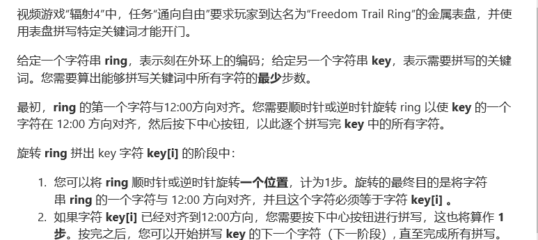
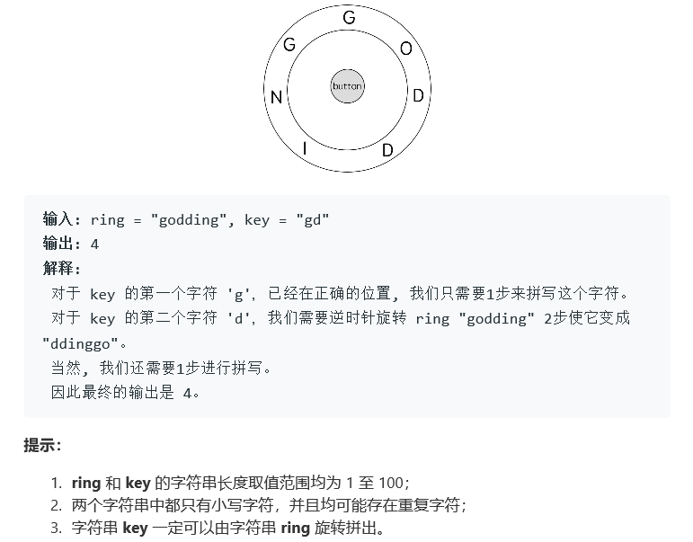

# 题目




# 算法

```python

```

```c++
class Solution {
public:
    const int INF = 1e8;
    int findRotateSteps(string ring, string key) {
        unordered_map<int, vector<int> > m;
        int N = ring.size();
        for (int i = 0; i < N; ++i) {
            m[ring[i] - 'a'].push_back(i);
        }
        vector<int> dp(N, INF);
        vector<int> start{0};
        dp[0] = 0; 
        for (int i = 0; i < key.size(); ++i) {
            vector<int>& prev = (i > 0) ? m[key[i - 1] - 'a'] : start;
            vector<int> dp1(N, INF);
            for (int i : m[key[i] - 'a']) {
                for (int j : prev) {
                    int t = abs(i - j);
                    dp1[i] = min(dp1[i], 1 + dp[j] + min(t, N - t));
                }
            }
            swap(dp, dp1);
        }
        return *min_element(dp.begin(), dp.end());
    }
}

作者：da-li-wang
链接：https://leetcode-cn.com/problems/freedom-trail/solution/c-dong-tai-gui-hua-by-da-li-wang-45/
来源：力扣（LeetCode）
著作权归作者所有。商业转载请联系作者获得授权，非商业转载请注明出处。
```

