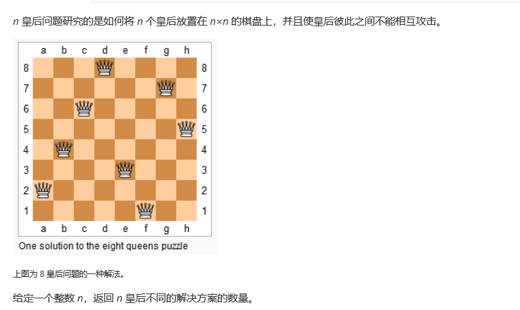
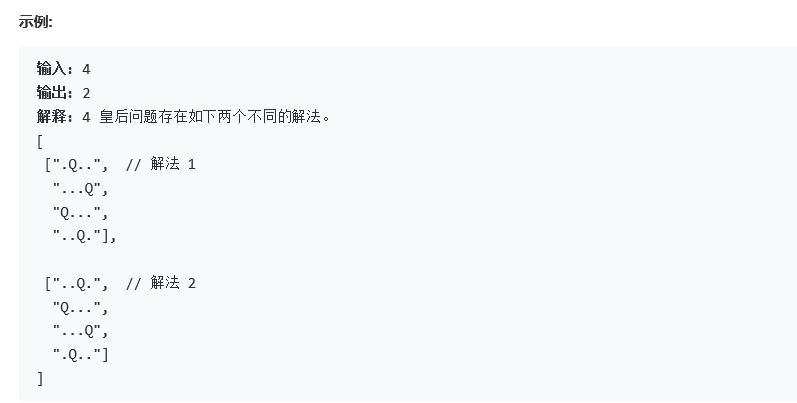

# 原题






# 算法

```
class Solution {
public:
    int cnt;
    void solve( vector<bool>& cols_, vector<bool>& diag1s_, vector<bool>& diag2s_, int n, int row){
        if(row == n){
            cnt += 1;
            return;
        }
        for(auto col = 0; col < n; col++){
            int ll = row + col;
            int rr = row - col + n - 1;
            if (cols_[col] && diag1s_[ll] && diag2s_[rr]){
                cols_[col] = false;
                diag1s_[ll] = false;
                diag2s_[rr] = false;

                solve( cols_, diag1s_, diag2s_, n, row+1);

                cols_[col] = true;
                diag1s_[ll] = true;
                diag2s_[rr] = true;
            }
        }
    }
    
    int totalNQueens(int n) {
        cnt = 0; 
        vector<bool> cols_(n, true);
        vector<bool> diag1s_(2*n-1, true);
        vector<bool> diag2s_(2*n-1, true);
        solve(cols_, diag1s_, diag2s_, n, 0);
        return cnt;
    }
};
```

* 算法本质上和数独算法有相似之处也是约束编程+回溯法的思想！我们首先分析一下两者的相同点和不同点：

* 解数独问题：

  * N确定，为9x9的网格，约束条件为：向未知位置填入1-9的数字，使得该数所在的行和列均不重复以及所在的3x3网格内也不重复，因此我们需要使用col_[9][9]、row_[9][9]、block_[9][9]来储存数字在行、列和网格中是否被使用过。使用过标记为true，否则标记为false。_
  * _N皇后问题：
    N不确定，因此我们需要在函数中建立辅助空间，而不能建立成成员变量，约束条件为：在NxN的网格中任意摆放皇后Q，为了避免皇后之间不能相互攻击，该位置所在的行、列以及主、副对角线均只能有这一个Q，因此我们需要使用cols_标记每一列是否存在Q，使用diag1s_、diag2s_来标记主、副对角线是否存在Q。
  * 当了解到这些之后，整个回溯递归方法就十分清晰了，中间有一个地方十分让人困惑，ll和rr是如何求解的呢？这就要说到主、副对角线的性质了！！！

  > 主对角线：col+row的值是一定的，范围[0, 2n-2]，从零开始
  > 副对角线：col-row的值是一定的，为了使索引有效，加上定值n-1, 最终范围[0, 2n-2]