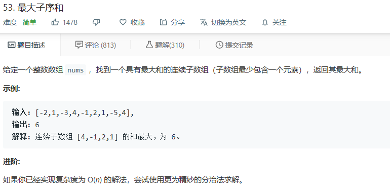

# 题目




# 算法

## 暴力

```
class Solution {
public:
    int maxSubArray(vector<int>& nums) {
        int size = nums.size();
        map<int,int> res;
        int max = nums[0];
        for(int i = 0; i < size; i++){
            res[i] = nums[i];
            max = (max < res[i])? res[i]:max;
            for(int j = 0; j < i; j++){
                res[j] += nums[i];
                max = (max < res[j])? res[j]:max;
            }
        }
        return max;
    }
};
```

简单的通过每个节点开始计算最大值的方式来求取最大连续子序列的数目。

因为max只是保存最大数据而为进入计算，所以相对比较容易理解，但是，此方法的事件复杂度为O（n^2），容易超出时间限制


## 动态规划


```
class Solution
{
public:
    int maxSubArray(vector<int> &nums)
    {
        //类似寻找最大最小值的题目，初始值一定要定义成理论上的最小最大值
        int result = INT_MIN;
        int numsSize = int(nums.size());
        //dp[i]表示nums中以nums[i]结尾的最大子序和
        vector<int> dp(numsSize);
        dp[0] = nums[0];
        result = dp[0];
        for (int i = 1; i < numsSize; i++)
        {
            dp[i] = max(dp[i - 1] + nums[i], nums[i]);
            result = max(result, dp[i]);
        }

        return result;
    }
};
```

这个算法有一个核心的问题，就在于他的递归式怎样保证：我们所有选择的子序列的结果是连续的。

在这里我们举一个例子：

​	

​	递归式子的调换实际上是要求，如果之前的max结果是负数，进行舍弃的操作。不进行此操作的时候，算法实际上走的是最近的结果。

​	此处的例子算法最好的结果实在最后位置，但实际上，这个算法同样需要max来进行中转比较。


另外，因为此算法只调用了dp的前一位，我们可以再次优化，将他优化到单int空间。(换种理解方式，也可以作为只要有小于0了，就放弃重新开始的贪心了解。)

```
class Solution
{
public:
    int maxSubArray(vector<int> &nums)
    {
        //类似寻找最大最小值的题目，初始值一定要定义成理论上的最小最大值
        int result = INT_MIN;
        int numsSize = int(nums.size());
        //因为只需要知道dp的前一项，我们用int代替一维数组
        int dp(nums[0]);
        result = dp;
        for (int i = 1; i < numsSize; i++)
        {
            dp = max(dp + nums[i], nums[i]);
            result = max(result, dp);
        }

        return result;
    }
};
```


## 另外

相传还有一种分治的算法解。