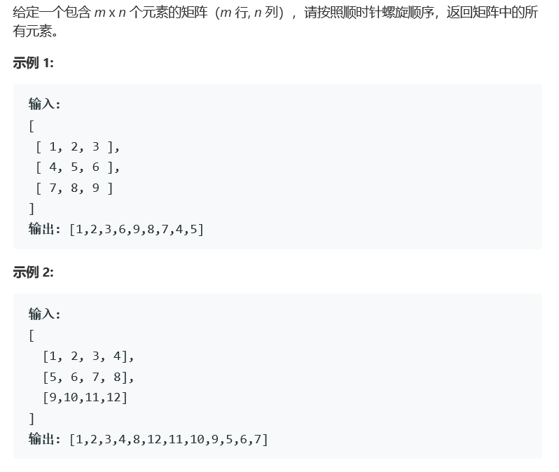

# 题目




# 算法

```
class Solution {
public:
    vector<int> res;
    void put(vector<vector<int>>& matrix,int a,int b,int m,int n){
        /*res.push_back(a);
        res.push_back(b);
        res.push_back(m);
        res.push_back(n);*/
        if(m <= 0 || n <= 0) return;
        int i = 0, j = 0;
        for(j = 0; j < n; j++)res.push_back(matrix[a][b+j]);
            j--;//&&&&
        for(i = 1;i<m;i++)res.push_back(matrix[a+i][b+j]);
        i--;
        for(j = n -2;j>=0 && m > 1/* &&&& */ ;j--) res.push_back(matrix[a+i][b+j]);
        for(i = m -2;i>0 && n > 1;i--) res.push_back(matrix[a+i][b]);

        put(matrix,a+1,b+1,m-2,n-2);
    }
    vector<int> spiralOrder(vector<vector<int>>& matrix) {
        res.clear();
        int m = matrix.size();
        if(m == 0) return res;
        if(m == 1) return matrix[0];
        int n = matrix[0].size();
        put(matrix,0,0,m,n);
        return res;
    }
};
```

## 设计思路

​	实际上就是简单的人类思维。按照一层一层的方式来剥取我们要的数。

​	注意点：代码中打`&&&&`的位置

* 第一点：for循环的推出条件为，判定式为否，也就是说，只有当控制变量`越界`的时候才会推出，也就是说，这个时候，i 和 j 实际上已经越界了，这里需要我们进行一个回撤的操作

* 第二点：对于剥取到最后的单层结构进行处理。在处理过程中，因为采用的是剥取一圈数据的方式，这种情况下，如果只有一层数据，我们的处理会对部分数据进行重新加入冗余。

  