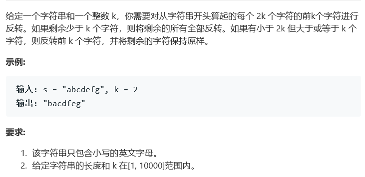

# 题目




# 算法

```python

```

```c++
class Solution {
public:
    void reverse_sub_str(string& s, int start, int end)
    {
        int size = end - start + 1;
        for (int i = 0; i < size / 2; ++i)
        {
            if (s.at(start + i) != s.at(end - i))
            {
                char tmp = s.at(start + i);
                s.at(start + i) = s.at(end - i);
                s.at(end - i) = tmp;
            }
        }
    }

    string reverseStr(string s, int k) {
        //前每2k个字符的个数
        int count = s.size() / (2 * k);

        for (int i = 0; i < count; ++i) //每2k个字符的前k个字符进行反转
        {
            reverse_sub_str(s, 2 * k * i, 2 * k * i + k - 1);
        }

        //剩余的字符数
        int left = s.size() % (2 * k);

        if (left >= k && left < 2 * k) //(剩余)小于 2k 但大于或等于 k 个字符, 则反转前 k 个字符
        {
            reverse_sub_str(s, 2 * k * count, 2 * k * count + k - 1);
        }
        else if(left < k) //剩余少于 k 个字符，则将剩余的所有全部反转
        {
            reverse_sub_str(s, 2 * k * count, s.size() - 1);
        }

        return s;
    }

};
```

