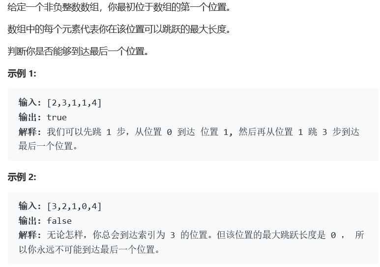

# 题目



# 算法

```
class Solution {
public:
    bool canJump(vector<int>& nums) {
        int size = nums.size();
        if(size == 0) return false;
        int maxPos = nums[0];
        for (int i = 1; i <= maxPos && i < size; i++)
        {
            maxPos = max(nums[i] + i, maxPos);
        }
        return maxPos >= size-1;
    }
};
```

这一题的算法与第45题 跳跃游戏II实际上为一个算法。通过简化操作可以达成。

注意点：

* nums每个节点为往后走的步数，也就是说，所有的maxPos为nums[i] + i
* 同时应当注意，maxPos为所有可以走到的最大的步数，也就是判定式应当可以取等。
* 同时，此算法的核心点在于，此跳跃为最大跳跃而非固定跳跃，也就是所有的maxPos之下的点实际上都是可达状态。