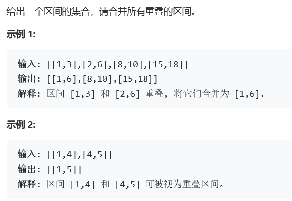

# 题目




# 算法

```
class Solution {
public:
   
    vector<vector<int>> merge(vector<vector<int>>& intervals) {
        int size = intervals.size();
        if(size < 2) return intervals;
        auto cmp = [](vector<int> &a, vector<int> &b) {return a[0] < b[0];};
        sort(intervals.begin(), intervals.end(), cmp);
        int left = intervals[0][0], right = intervals[0][1],loc = 0, num = 1;
        vector<vector<int>> res;
        while(loc + num < size){
            if(right >= intervals[loc+num][0]){
                if(right < intervals[loc+num][1])
                    right = intervals[loc+num][1];
                    num++;
                //继续向右扩列
            }else{
                vector<int> tmp;
                tmp.push_back(left);
                tmp.push_back(right);
                res.push_back(tmp);
                loc = loc + num;
                num = 1;
                left = intervals[loc][0];
                right = intervals[loc][1];
            }
        }
        
        //handle the last
        if(right >= intervals[size-1][0]){
            if(right < intervals[size-1][1])right = intervals[size-1][1];
        }
        vector<int> tmp;
        tmp.push_back(left);
        tmp.push_back(right);
        res.push_back(tmp);
        return res;
    }
};
```

算法重点：

* > auto cmp = [](vector<int> &a, vector<int> &b) {return a[0] < b[0];};
  > sort(intervals.begin(), intervals.end(), cmp);

  >此处为sort比较方法的重载为重要的方法。

  通过重载sort算法进行输入数组的再排序，这个时候，才可以方便我们进行时间复杂度为O(n)的合并算法

* 算法核心维护了一对左右极值，和一对位置点。

  位置点很好理解，就是算法运行到此处我们已经覆盖到的数对。

  左右极值实际上是维护了一个融合数组的左右值。

* 因为排过序的原因，所以我们可以断定x位之后的所有左值都在x位的左值之后，那么我们判定数组是否可融合的依据就是，下一位的左值和维护的右值的关系了。

* 同时，注意下为了防止溢出，我们在循环中不处理最后一个数对。但是此时的left和right的左右值仍然在维护中。可以直接使用

* 以上算法的空间复杂度只超过5%，大部分的原因在于，我们为了省去删除vector中间元素的时间，直接将结果存入了新的res vector。这样做，同时还方便了我们对于loc和num的维护。如果要在原vector上更改的话，请务必注意loc的改动。